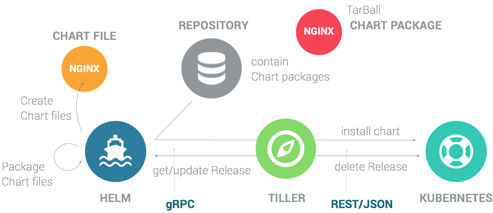

FADI - Installation
=======

This page describes how to install the FADI platform 

1. on a laptop/workstation, using [Minikube](https://github.com/kubernetes/minikube)
2. on a generic Kubernetes cluster
3. on Google Kubernetes Engine (GKE) 

The last section describes how to automate the deployment using Gitlab-CI.

Once FADI is installed, head to the [user guide](USERGUIDE.md)

The deployment of the FADI stack is achieved with:

* [Helm](https://helm.sh/).
* [Kubernetes](https://kubernetes.io/).



## 1. Local installation

This type of installation provides a quick way to test the platform, and also to adapt it to your needs.

### 1.1. Prerequisites

The following tools need to be installed on the host system:

* a virtualisation solution (for example [VirtualBox](https://www.virtualbox.org/wiki/Downloads) or KVM)
* [Kubectl](https://kubernetes.io/docs/tasks/tools/install-kubectl/), the Kubernetes CLI
* [Minikube](https://github.com/kubernetes/minikube/releases), a local Kubernetes cluster
* the [Helm client](https://helm.sh/docs/using_helm/#installing-helm)

Make sure that the computer you are installing FADI to is powerful enough (currently, 6vcpu's and 12GB RAM are needed for comfortable use).

### 1.2. Local deployment

Delete any previously created Minikube installation:

```bash
minikube delete
```

Start Minikube:

```bash
minikube start --cpus 6 --memory 12288 --disk-size=40GB
```

Note: the vm driver can be specified as such: `--vm-driver kvm2` or `--vm-driver virtualbox`

To get the Kubernetes dashboard, type:

```bash
minikube dashboard
```

This will open a browser window with the [Kubernetes Dashboard](http://127.0.0.1:40053/api/v1/namespaces/kube-system/services/http:kubernetes-dashboard:/proxy/), it should look like this:


Clone this repository:

```bash
git clone https://github.com/cetic/fadi.git fadi
cd fadi
```

**Note for Mac users :** you need to change the network interface in the Minikube vm: in the VirtualBox GUI, go to `minikube->Configuration->Network->Interface 1->advanced` and change `Interface Type` to `PCnet-FAST III` (the minikube vm should be shut down in order to be able to change the network interface: `minikube stop`

Launch the Helm script, this will deploy all the FADI services on the Minikube cluster (and may take some time).

```bash
kubectl config set-context minikube
cd helm
# you can edit values.yaml file to customise the stack
./deploy.sh
# see deploy.log for connection information to the various services
```

You can check everything is deploying/-ed in the Kubernetes dashboard:


To access a service in your browser, type for instance:

```bash
minikube service list
minikube service -n fadi fadi-nifi
```

To update the FADI stack, re-type:

```
cd helm
./deploy.sh
```

To delete the FADI stack, type:

```
cd helm
./teardown.sh
```

## 2. Deployment on a generic Kubernetes cluster

First, clone this repository.

```bash
git clone https://github.com/cetic/fadi.git fadi
cd fadi
```

Set your Kubernetes context:

```bash
kubectl config set-context <your-k8s-context>
```

Finally, you can deploy the full FADI stack by typing:

```bash
cd helm
./deploy.sh
```

Note that depending on your workstation size and network connection, this could take some time (at least 5 minutes)

Now that you have a sandbox with FADI on your workstation, you can try it with a [simple use case](USERGUIDE.md)

### 3. Deployment on GKE

[GKE](https://cloud.google.com/kubernetes-engine/) is a managed Kubernetes offer by the Google Cloud Platform (GCP).

> "Kubernetes Engine is a managed, production-ready environment for deploying containerized applications. It brings our latest innovations in developer productivity, resource efficiency, automated operations, and open source flexibility to accelerate your time to market."

The creation of a GKE environment can be done with [Terraform](https://www.terraform.io/) or manually. 

See the Terraform scripts for the creation of the Kubernetes cluster [here](/terraform) and its documentation [here](/terraform/README.md).

To manually create a Kubernetes cluster (GKE):

1. Visit the Google Kubernetes Engine menu in [GCP Console]([here](https://console.cloud.google.com)).
2. Click `Create cluster`.
3. Choose the Standard cluster template or choose an appropriate template for your workload.
4. From the Cluster Version drop-down menu, select the desired GKE version to run in the cluster.

It is also possible to create the Kubernetes cluster in command line, see: https://cloud.google.com/kubernetes-engine/docs/how-to/creating-a-cluster

### 4. Troubleshooting

* Installation logs are located in the `helm/deploy.log` file.
* Enable local monitoring in minikube: `minikube addons enable metrics-server`

### 5. Continuous integration (CI) and deployment (CD)

See [.gitlab-ci.sample.yml](.gitlab-ci.sample.yml) for an example CI setup with [Gitlab-CI](https://about.gitlab.com/product/continuous-integration/).
