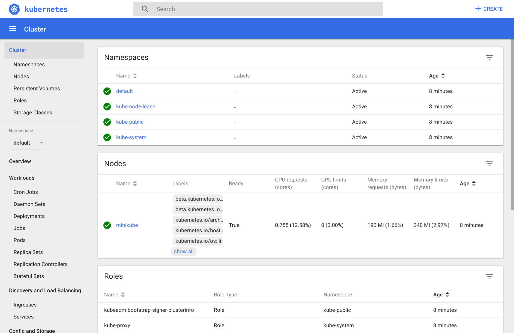
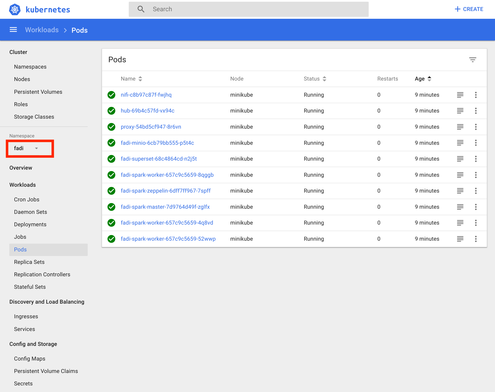

FADI - Installation
=======

* [1. Local installation](#1-local-installation)
    * [1.1. Prerequisites](#11-prerequisites)
    * [1.2. Local deployment](#12-local-deployment)
* [2. Deployment on a generic Kubernetes cluster](#2-deployment-on-a-generic-kubernetes-cluster)
* [3. Deployment on GKE](#3-deployment-on-gke)
* [4. Troubleshooting](#4-troubleshooting)
* [5. Continuous integration (CI) and deployment (CD)](#5-continuous-integration-ci-and-deployment-cd)
* [6. Additional configuration](#6-additional-configuration)


This page describes how to install the FADI platform 

1. on a laptop/workstation, using [Minikube](https://github.com/kubernetes/minikube) for local development
2. on a generic Kubernetes cluster for a self-hosted installation
3. on Google Kubernetes Engine (GKE) as an example of public cloud

The last sections describes how to automate the deployment using Gitlab-CI, and configure various parts of FADI (user management, ...).

Once FADI is installed, head to the [user guide](USERGUIDE.md)

The deployment of the FADI stack is achieved with:

* [Helm v3](https://helm.sh/).
* [Kubernetes](https://kubernetes.io/).

## 1. Local installation

This type of installation provides a quick way to test the platform, and also to adapt it to your needs.

### 1.1. Prerequisites

The following tools need to be installed on the host system:

* a virtualisation solution (for example [VirtualBox](https://www.virtualbox.org/wiki/Downloads) or KVM)
* [Kubectl](https://kubernetes.io/docs/tasks/tools/install-kubectl/), the Kubernetes CLI
* [Minikube](https://github.com/kubernetes/minikube/releases), a local Kubernetes cluster
* the [Helm client v3](https://helm.sh/docs/using_helm/#installing-helm) (please, install >3.0 version of Helm)

Make sure that the computer you are installing FADI to is powerful enough (currently, 6vcpu's and 12GB RAM are needed for comfortable use).

### 1.2. Local deployment

#### 1.2.1. Prepare the local Kubernetes cluster

Delete any previously created Minikube installation:

```bash
minikube delete
```

Start Minikube:

```bash
minikube start --cpus 6 --memory 12288 --disk-size=40GB
```

Notes: 

* the vm driver can be specified as such: `--vm-driver kvm2` or `--vm-driver virtualbox`
* a partial FADI stack would need less ressources, edit [the config file](/helm/values.yaml) accordingly to disable services that are not needed.

To get the Kubernetes dashboard, type:

```bash
minikube dashboard
```

This will open a browser window with the Kubernetes Dashboard:



**Note for Mac users :** you need to change the network interface in the Minikube vm: in the VirtualBox GUI, go to `minikube->Configuration->Network->Interface 1->advanced` and change `Interface Type` to `PCnet-FAST III` (the minikube vm should be shut down in order to be able to change the network interface: `minikube stop`

#### 1.2.2. Install FADI services on the local cluster

Clone this repository:

```bash
git clone https://github.com/cetic/fadi.git fadi
cd fadi
```

Launch the Helm script, this will deploy all the FADI services on the Minikube cluster (and may take some time).

```bash
kubectl config set-context minikube
minikube addons enable ingress
cd helm
# you can edit values.yaml file to customise the stack
./deploy.sh
# specify the fadi namespace to see the different pods
kubectl config set-context minikube --namespace fadi
```

You can check everything is deploying/-ed in the Kubernetes dashboard:

Do not forget to specify the namespace to `fadi`




To list the different services of fadi framework:

```
minikube service list
```

To list the different fadi pods and their status:

```
kubectl get pods
```

To access a service in your browser, type for instance:

```
minikube service -n fadi fadi-nifi
```

You can list all the addresses by typing:

```
kubectl get ingress -n fadi
```

To update the FADI stack, re-type:

```
cd helm
./deploy.sh
```

To delete the FADI stack, type:

```
cd helm
./teardown.sh
```

Now that you have a sandbox with FADI on your workstation, you can try it with a [simple use case](USERGUIDE.md).

## 2. Deployment on a generic Kubernetes cluster

First, clone this repository.

```bash
git clone https://github.com/cetic/fadi.git fadi
cd fadi
```

Set your Kubernetes context:

```bash
kubectl config set-context <your-k8s-context>
```

* make sure you have a **default StorageClass** in your cluster (see the [FAQ entry](FAQ.md))
* configure external access to the services: 
  * Reverse proxy configuration guide : https://github.com/cetic/fadi/blob/feature/documentation/doc/REVERSEPROXY.md
  * Port forwarding instructions: https://github.com/cetic/fadi/issues/81

Finally, you can deploy the full FADI stack by typing:

```bash
cd helm
./deploy.sh
```

Note that depending on your workstation size and network connection, this could take some time (at least 5 minutes)

## 3. Deployment on GKE

[GKE](https://cloud.google.com/kubernetes-engine/) is a managed Kubernetes offer by the Google Cloud Platform (GCP).

> "Kubernetes Engine is a managed, production-ready environment for deploying containerized applications. It brings our latest innovations in developer productivity, resource efficiency, automated operations, and open source flexibility to accelerate your time to market."

The creation of a GKE environment can be done with [Terraform](https://www.terraform.io/) or manually. 

See the [Terraform scripts](/terraform) for the creation of the Kubernetes cluster and its [documentation](/terraform/README.md).

To manually create a Kubernetes cluster (GKE):

1. Visit the Google Kubernetes Engine menu in [GCP Console]([here](https://console.cloud.google.com)).
2. Click `Create cluster`.
3. Choose the Standard cluster template or choose an appropriate template for your workload.
4. From the Cluster Version drop-down menu, select the desired GKE version to run in the cluster.

It is also possible to create the Kubernetes cluster in command line, see: https://cloud.google.com/kubernetes-engine/docs/how-to/creating-a-cluster

## 4. Troubleshooting

* Installation logs are located in the `helm/deploy.log` file.
* Check the Minikube and Kubernetes logs:
```bash
minikube logs
kubectl get events --all-namespaces
kubectl get events -n fadi
kubectl get pods -n fadi
kubectl logs fadi-nifi-xxxxx -n fadi
```
* Enable [metrics server](https://kubernetes.io/docs/tasks/debug-application-cluster/resource-metrics-pipeline/#metrics-server) in minikube: `minikube addons enable metrics-server`
* The [FAQ](FAQ.md) provides some guidance on common issues
* For Windows users, please refer to the following [issue](https://github.com/cetic/fadi/issues/55).

## 5. Continuous integration (CI) and deployment (CD)

See [.gitlab-ci.sample.yml](.gitlab-ci.sample.yml) for an example CI setup with [Gitlab-CI](https://about.gitlab.com/product/continuous-integration/).

A lightweight alternative to a proper Kubernetes cluster (for example for continuous integration or testing purposes) would be to install FADI in minikube (single node).

Setup a server (VM or bare metal) with the following specifications:

* 20 GB RAM
* 8 CPUs
* Debian 9
* Docker, minikube, git, vim, kubectl, ...
    * for port-forwarding: `sudo apt-get install socat`
    
Launch minikube (in this case with `vm-driver` as `none`, see limitations of this approach [here](https://minikube.sigs.k8s.io/docs/reference/drivers/none/)):

```
sudo minikube start --vm-driver=none
# now install FADI as usual:
git clone https://github.com/cetic/fadi.git fadi
cd fadi
kubectl config set-context minikube
minikube addons enable ingress
cd helm
# you can edit values.yaml file to customise the stack
./deploy.sh
# specify the fadi namespace to see the different pods
kubectl config set-context minikube --namespace fadi
```

Open minikube to the outside world (make sure you know what you are doing here):

```
kubectl proxy --address='0.0.0.0' --disable-filter=true
```

## 6. Additional configuration

See the [user management documentation](doc/USERMANAGEMENT.md) for information on how to configure user identification and authorization (LDAP, RBAC, ...).

See the [logs management documentation](doc/LOGGING.md) for information on how to configure logging.

See the [reverse proxy documentation](doc/REVERSEPROXY.md) for information on how to configure the Traefik reverse proxy with FADI.

See the [security documentation](doc/SECURITY.md) for information on how to configure SSL.

See the [TSimulus documentation](doc/TSIMULUS.md) for information on how to simulate sensors and generate realistic data with [TSimulus](https://github.com/cetic/TSimulus). 
