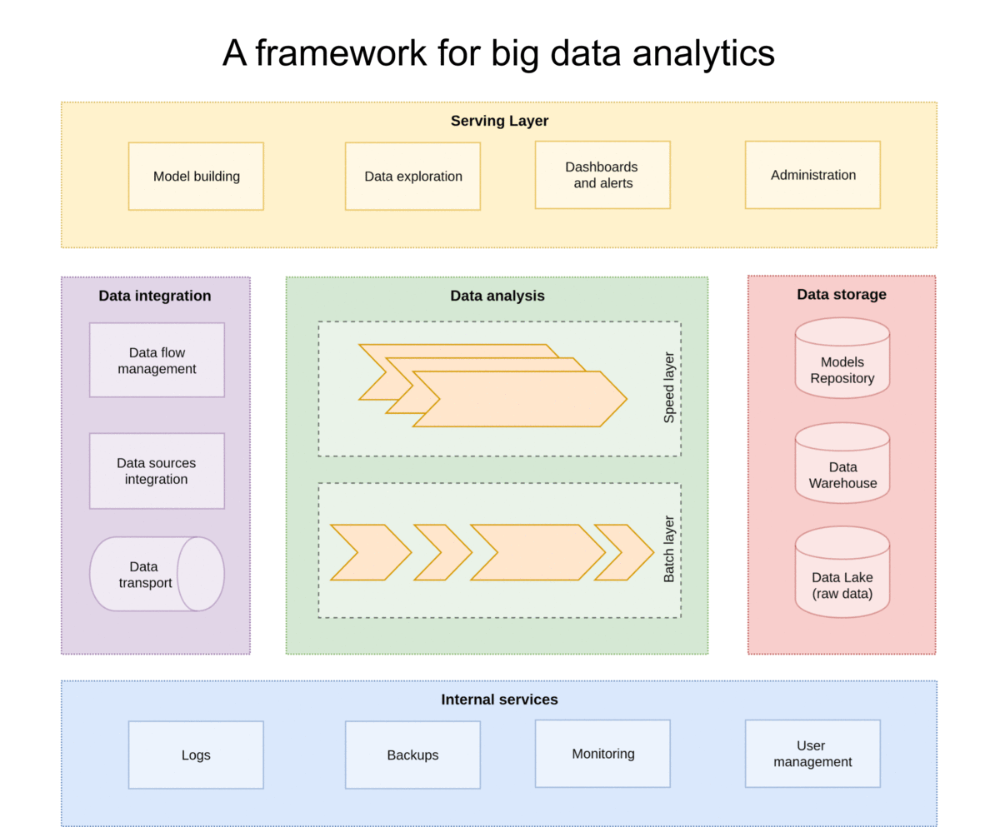

# FADI - A framework for big data analytics
  

  

 
## What is FADI?

FADI is a Cloud Native platform for Big Data based on mature open source tools.
The FADI project is dedicated to making the deployment of Big Data tools simple, portable and scalable. 
The goal is to provide a straightforward way to deploy open-source systems for Big Data to various infrastructures (private and public clouds). 
Anywhere you can run [Kubernetes](https://kubernetes.io/), you should be able to run FADI.

## Quick start

1. [Install the framework on your workstation](INSTALL.md)
2. Try [a simple use case](USERGUIDE.md)

You can find a more detailed explanation of FADI in the [presentation slideshow](https://fadi.presentations.cetic.be)

## FADI Helm Chart

This [repository](https://github.com/cetic/helm-fadi) contains the Helm chart to install FADI in a Kubernetes cluster.

## Support

In case you encounter an issue with FADI, have a feature request or any other question, feel free to [open an issue](https://github.com/cetic/fadi/issues/new/choose).

Feel also free to check out [the FAQ](FAQ.md)!

## Contributors

Thanks goes to these wonderful people ([emoji key](https://allcontributors.org/docs/en/emoji-key)):

<!-- ALL-CONTRIBUTORS-LIST:START - Do not remove or modify this section -->
<!-- prettier-ignore -->
<table>
  <tr>
    <td align="center"><a href="https://github.com/banzo"> <b>Sebastien Dupont</b></a> <a href="https://github.com/cetic/fadi/commits?author=banzo" title="Code">💻</a> <a href="#review-banzo" title="Reviewed Pull Requests">👀</a></td>
    <td align="center"><a href="https://www.linkedin.com/in/alexandre-nuttinck/"> <b>Alexandre Nuttinck</b></a> <a href="https://github.com/cetic/fadi/commits?author=alexnuttinck" title="Code">💻</a> <a href="#review-alexnuttinck" title="Reviewed Pull Requests">👀</a> <a href="#infra-alexnuttinck" title="Infrastructure (Hosting, Build-Tools, etc)">🚇</a></td>
    <td align="center"><a href="https://github.com/AyadiAmen"> <b>Amen Ayadi</b></a> <a href="https://github.com/cetic/fadi/commits?author=AyadiAmen" title="Code">💻</a> <a href="#design-AyadiAmen" title="Design">🎨</a></td>
    <td align="center"><a href="https://sites.google.com/site/faiezzalila/"> <b>Faiez Zalila</b></a> <a href="https://github.com/cetic/fadi/commits?author=fzalila" title="Code">💻</a> <a href="https://github.com/cetic/fadi/commits?author=fzalila" title="Tests">⚠️</a></td>
    <td align="center"><a href="https://github.com/FabianSteels"> <b>Fabian Steels</b></a> <a href="#ideas-FabianSteels" title="Ideas, Planning, & Feedback">🤔</a></td>
    <td align="center"><a href="https://github.com/smouton-cetic"> <b>Stephane Mouton</b></a> <a href="#projectManagement-smouton-cetic" title="Project Management">📆</a></td>
    <td align="center"><a href="https://github.com/nikosmtsk"> <b>Nikolaos Matskanis</b></a> <a href="#projectManagement-nikosmtsk" title="Project Management">📆</a></td>
  </tr>
  <tr>
    <td align="center"><a href="https://github.com/Sellto"> <b>Tom Selleslagh</b></a> <a href="https://github.com/cetic/fadi/commits?author=Sellto" title="Documentation">📖</a></td>
    <td align="center"><a href="https://github.com/terence-bigtt"> <b>Terence Delsate</b></a> <a href="https://github.com/cetic/fadi/commits?author=terence-bigtt" title="Code">💻</a></td>
    <td align="center"><a href="https://github.com/Maher-badri"> <b>Maher Badri</b></a> <a href="#projectManagement-Maher-badri" title="Project Management">📆</a></td>
  </tr>
</table>

<!-- ALL-CONTRIBUTORS-LIST:END -->

This project follows the [all-contributors](https://github.com/all-contributors/all-contributors) specification. Contributions of any kind welcome! (see the [contributions guidelines](CONTRIBUTING.md))

## About

You can find out more about FADI on the [CETIC website](https://cetic.be/FADI)