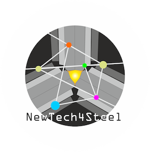
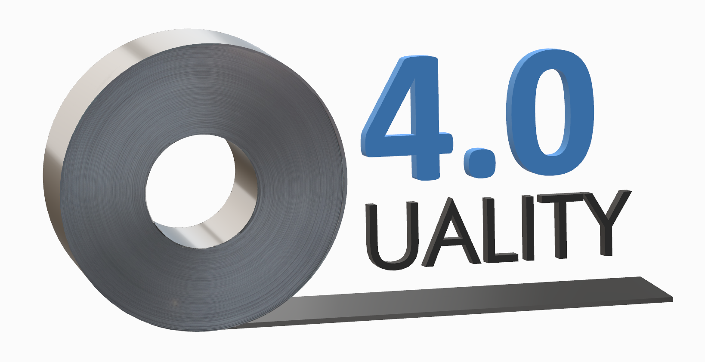

# FADI - A framework for big data analytics
  

  

    
  

  

      <table style="border:none;">
        <tr>
          <td style="text-align: center; vertical-align: middle;" align="center"></td>
          <td style="text-align: center; vertical-align: middle;" align="center"></td>
          <td style="text-align: center; vertical-align: middle;" align="center"></td>
          <td style="text-align: center; vertical-align: middle;" align="center"></td>
        </tr>
        <tr>
          <td style="text-align: center; vertical-align: middle;" align="center"><a href="INSTALL.md">Installation</a></td>
          <td style="text-align: center; vertical-align: middle;" align="center"><a href="USERGUIDE.md">User guide</a></td>
          <td style="text-align: center; vertical-align: middle;" align="center"><a href="https://fadi.presentations.cetic.be">Presentation</a></td>
          <td style="text-align: center; vertical-align: middle;" align="center"><a href="FAQ.md">FAQ</a></td>
        </tr>
      </table>
  

 
## What is FADI?

FADI is a Cloud Native platform for Big Data based on mature open source tools.
The FADI project is dedicated to making the deployment of Big Data tools simple, portable and scalable. 
The goal is to provide a straightforward way to deploy open-source systems for Big Data to various infrastructures (private and public clouds). 
Anywhere you can run [Kubernetes](https://kubernetes.io/), you should be able to run FADI.

## Quick start

1. [Install the framework on your workstation](INSTALL.md)
2. Try [a simple use case](USERGUIDE.md)

## FADI architecture

The figure below presents the various components of the architecture, with implementation choices.

You can find a more detailed explanation of the various components in the [architecture presentation](https://fadi.presentations.cetic.be)

## FADI Helm Chart

This [repository](https://github.com/cetic/helm-fadi) contains the Helm chart to install FADI in a Kubernetes cluster.

## Support

In case you encounter an issue with FADI, have a feature request or any other question, feel free to [open an issue](https://github.com/cetic/fadi/issues/new/choose).

## Contributors ✨

Thanks goes to these wonderful people ([emoji key](https://allcontributors.org/docs/en/emoji-key)):

<!-- ALL-CONTRIBUTORS-LIST:START - Do not remove or modify this section -->
<!-- prettier-ignore -->
<table>
  <tr>
    <td align="center"><a href="https://github.com/banzo"> <b>banzo</b></a> <a href="https://github.com/cetic/fadi/commits?author=banzo" title="Code">💻</a> <a href="#review-banzo" title="Reviewed Pull Requests">👀</a></td>
    <td align="center"><a href="https://www.linkedin.com/in/alexandre-nuttinck/"> <b>Alexandre Nuttinck</b></a> <a href="https://github.com/cetic/fadi/commits?author=alexnuttinck" title="Code">💻</a> <a href="#review-alexnuttinck" title="Reviewed Pull Requests">👀</a> <a href="#infra-alexnuttinck" title="Infrastructure (Hosting, Build-Tools, etc)">🚇</a></td>
  </tr>
</table>

<!-- ALL-CONTRIBUTORS-LIST:END -->

This project follows the [all-contributors](https://github.com/all-contributors/all-contributors) specification. Contributions of any kind welcome!

## Thanks

This project has been realised in the context of the following research projects:

<table style="border:none;" width="100%">
    <tr>
      <td style="text-align: center; vertical-align: middle;" align="center"></td>
      <td style="text-align: center; vertical-align: middle;" align="center"></td>
      <td style="text-align: center; vertical-align: middle;" align="center"></td>
      <td style="text-align: center; vertical-align: middle;" align="center"></td>
    </tr>
    <tr>
      <td style="text-align: center; vertical-align: middle;" align="center"><a href="https://www.bigdata-ma.eu/">Bigdata@MA</a> - Big Data application at MAnufacturing industry</td>
      <td style="text-align: center; vertical-align: middle;" align="center"><a href="https://www.cetic.be/Nouvelle-traduction-GRINDING-4-0">Grinding 4.0</a> - Smart 4.0 machine cell model for automotive cutting tool grinding services</td>
      <td style="text-align: center; vertical-align: middle;" align="center"><a href="http://newtech4steel.eu/">NewTech4Steel</a> - New technologies for real-time monitoring and control of steel production</td>
      <td style="text-align: center; vertical-align: middle;" align="center"><a href="https://www.quality-40.eu/">Quality 4.0</a> - Transparent product quality supervision in the age of Industry 4.0</td>
    </tr>
</table>