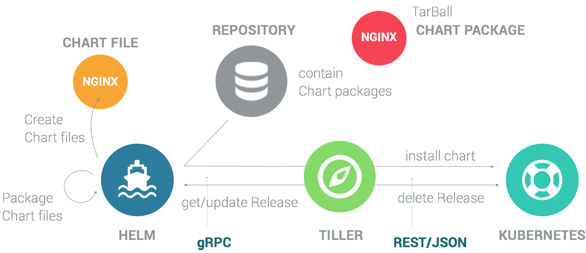

# FADI - A framework for big data analytics


FADI is a Cloud Native platform for Big Data based on mature open source tools.

## What is FADI?

The FADI project is dedicated to making the deployment of Big Data tools on [Kubernetes](https://kubernetes.io/) simple, portable and scalable. 
The goal is to provide a straightforward way to deploy open-source systems for Big Data to various infrastructures (private and public clouds). 
Anywhere you can run Kubernetes, you should be able to run FADI.

### 0. Getting started

#### 0.1. Prerequisites

* Install VirtualBox: https://www.virtualbox.org/wiki/Downloads
* Install Kubectl: https://kubernetes.io/docs/tasks/tools/install-kubectl/
* Install Minikube: https://github.com/kubernetes/minikube/releases (At least v0.32 of Minikube)
* Install Helm: https://helm.sh/docs/using_helm/#installing-helm

#### 0.2. Local deployment

Start Minikube:

Delete any previous Minikube created:

```
minikube delete
```

Start Minikube:

```
minikube start --cpus 6 --memory 12288 --disk-size=40GB
```

To get the Kubernetes dashboard, type:

```
minikube dashboard
```

Clone this repository.

```
git clone https://github.com/cetic/fadi.git fadi
```

**For Mac users :** you need to change the network interface in the Minikube vm:

```
- in Virtual box go to minikube->Configuration->Network(Réseau)->Interface 1->advanced(avancé).
--> change Interface Type to PCnet-FAST III (the minikube vm should be shut down in order to be able to change the network interface -> you can use the command "minikube stop")
```

Launch the script:

```
cd helm
./deploy.sh
```

To access a service in your browser, you can just type, for instance:

```
minikube service -n bdf nifi
```

To update the FADI stack, re-type:

```
cd helm
./deploy.sh
```

To delete the FADI stack, type:

```
cd helm
./teardown.sh
```

#### 0.3. Deployment with Helm and Kubernetes

The deployment of the FADI stack is achieved with:

* [Helm](https://helm.sh/).
* [Kubernetes](https://kubernetes.io/).



First, clone this repository.

```
git clone https://github.com/cetic/fadi.git fadi
```

Then, to deploy FADI on your Kubernetes cluster, you can follow this [deployment script](/helm/deploy.sh).

You will need to modify the first line by your Kubernetes context:

```
kubectl config set-context <your-k8s-context>
```

Finally, you can deploy the FADI stack by typing:

```
cd helm
./deploy.sh
```

#### 0.4. Deployment on GKE

[GKE](https://cloud.google.com/kubernetes-engine/) is a managed Kubernetes offer by the Google Cloud Platform (GCP).

> "Kubernetes Engine is a managed, production-ready environment for deploying containerized applications. It brings our latest innovations in developer productivity, resource efficiency, automated operations, and open source flexibility to accelerate your time to market."

* The creation of a GKE environment can be done with [Terraform](https://www.terraform.io/) or manually. 
See the [Terraform](https://www.terraform.io/) scripts for the creation of the Kubernetes cluster [here](/terraform) and its documentation.

To manually create a Kubernetes cluster (GKE):

You can access the console of GCP [here](https://console.cloud.google.com).

* 1- Visit the Google Kubernetes Engine menu in GCP Console. ...
* 2- Click Create cluster.
* 3- Choose the Standard cluster template or choose an appropriate template for your workload.
* 4- From the Cluster Version drop-down menu, select the desired GKE version to run in the cluster.

It's also possible to create the Kubernetes cluster in command lines, see: https://cloud.google.com/kubernetes-engine/docs/how-to/creating-a-cluster

* The deployment of the FADI stack is achieved with [Helm](https://helm.sh/) and [Kubernetes](https://kubernetes.io/). See the Section 0.3.

### 1. BDF technology Stack

#### 1.1. available or in-progress

| BDF Tools | Current version  | Helm Chart | Configuration | Additional Informations |
|-----------|:----------------:|-----------:|--------------:|------------------------:|
| **Superset** | 0.28.1 | https://github.com/helm/charts/tree/master/stable/superset | More informations about configurations of superset [here](helm/superset/README.md) | Persistant: 8Gi
| **PostgreSQL** | 10.7.0 | https://github.com/helm/charts/tree/master/stable/postgresql | More informations about configurations of PostgreSQL [here](helm/postgresql/README.md). | Persistant: 8Gi
| **PgAdmin** | 4.7 | https://github.com/cetic/helm-pgadmin | More informations about configurations of pgadmin [here](helm/pgadmin/README.md) | /
| **Minio** | RELEASE.2018-12-06T01-27-43Z |  https://github.com/helm/charts/tree/master/stable/minio | More informations about configurations of minio [here](helm/minio/README.md). |  Persistant: 10Gi
| **Jupyter Hub** | 0.8.2 | https://github.com/jupyterhub/zero-to-jupyterhub-k8s | More informations about configurations of JupyterHub [here](helm/jupyterhub/README.md). | Not persistant, to change , https://z2jh.jupyter.org/en/latest/
| **Nifi** | *** | Not for the moment, the old Kubernetes scripts are used. Should be converted in Helm scripts. | See [here](k8s/nifi/). | Not persistant, to change
| **Grafana** | 6.1.4 | https://github.com/helm/charts/tree/master/stable/grafana | More informations about configurations of grafana [here](helm/grafana/README.md). | Persistant: 10Gi
| **Spark** | 1.5.1_v3 | https://github.com/helm/charts/tree/master/stable/spark | More informations about configurations of Spark [here](helm/spark/README.md). | The Helm Chart includes Zeppelin.

#### 1.2. not available for the moment

* **airflow**: https://github.com/helm/charts/tree/master/stable/airflow

* **zeppelin**: https://github.com/helm/charts/tree/master/stable/zeppelin (Zeppelin is already integrated in the Spark Helm Chart.)

* **OpenLDAP**: https://github.com/helm/charts/tree/master/stable/openldap

* **Prometheus**: https://github.com/helm/charts/tree/master/stable/prometheus

* **Vault**: https://github.com/helm/charts/tree/master/stable/vault-operator, https://github.com/helm/charts/tree/master/incubator/vault

* **Istio**: https://github.com/helm/charts/tree/master/incubator/istio

* **Kafka**: https://github.com/helm/charts/tree/master/incubator/kafka

* **Zookeeper**: https://github.com/helm/charts/tree/master/incubator/zookeeper

* **Kubernetes Dashboard**: https://github.com/helm/charts/tree/master/stable/kubernetes-dashboard

### 2. Technical specifications

### 2.1. Logical View


### 2.2. Implementation View


### 2.3. Deployment View - GKE


### 2.4. Deployment View - Kubernetes On-Premise


### Fridge

* Helm Secrets: https://github.com/futuresimple/helm-secrets

* For GKE: https://helm.sh/docs/using_helm/#gke
