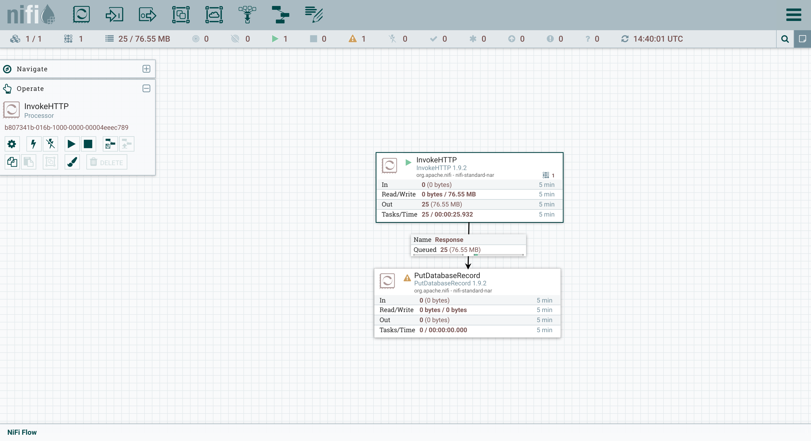
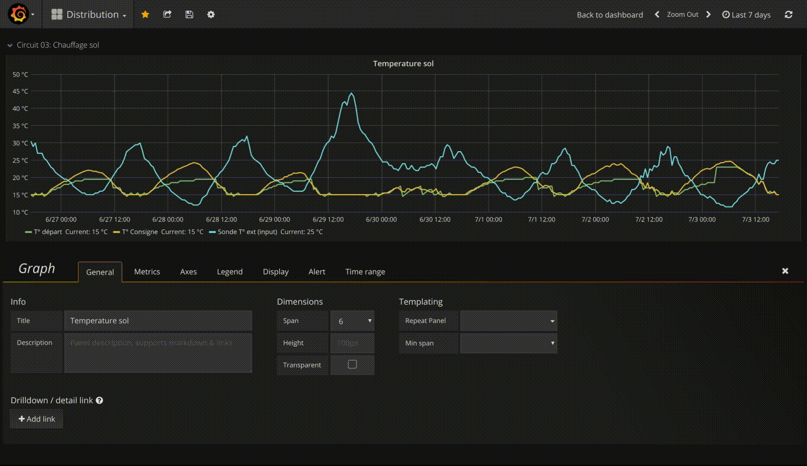
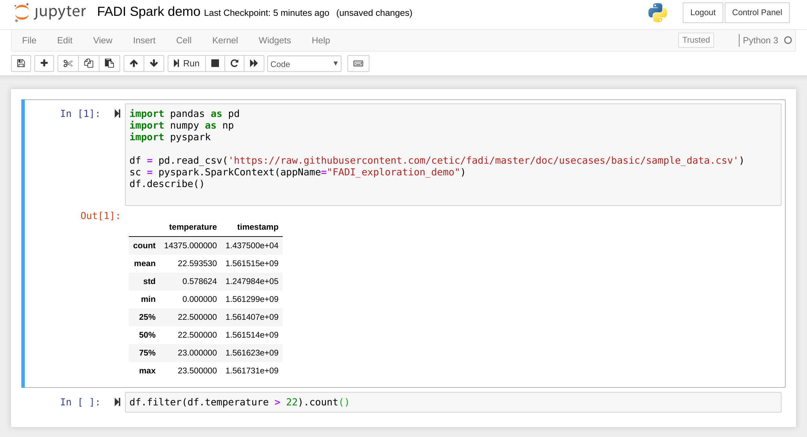

FADI User guide
=========

This page provides documentation on how to use the FADI big data framework.

A sample use case - Building monitoring at CETIC offices
---------------


In this simple example, we will ingest temperature measurements from sensors, store them and display them in a simple dashboard.

### 1. Install FADI

To install the FADI framework on your workstation or on a cloud, see the [installation instructions](INSTALL.md). 

The components needed for this use case are the following:

* Apache Nifi as a integration tool to ingest the sensor data from the data source (a csv file in this case) and store it in the database
* PostgreSQL as both a datawarehouse and datalake
* Gafana as a dashboard tool to display graphs from the data ingested and stored in the datalake

Those components are configured in the following [sample config file](helm/deploy.sh), once the platform is ready, you can start working with it. The following instructions assume that you deployed FADI on your workstation inside minikube.

### 2. Ingest and store measurements 

<a href="http://nifi.apache.org/" alt="Apache Nifi"></a>

> "An easy to use, powerful, and reliable system to process and distribute data."

[Apache Nifi](http://nifi.apache.org/) provides ingestion mechanism (to e.g. connect a database, REST API, csv/json/avro files on a FTP, ... for ingestion): in this case we want to read the temperature sensors data from our HVAC system and store it in a database.

Temperature measurements from the last 5 days (see [HVAC sample temperatures csv extract](examples/basic/sample_data.csv)) are ingested:

```csv
measure_ts,temperature
2019-06-23 14:05:03.503,22.5
2019-06-23 14:05:33.504,22.5
2019-06-23 14:06:03.504,22.5
2019-06-23 14:06:33.504,22.5
2019-06-23 14:07:03.504,22.5
2019-06-23 14:07:33.503,22.5
2019-06-23 14:08:03.504,22.5
2019-06-23 14:08:33.504,22.5
2019-06-23 14:09:03.503,22.5
2019-06-23 14:09:33.503,22.5
2019-06-23 14:10:03.503,22.5
2019-06-23 14:10:33.504,22.5
2019-06-23 14:11:03.503,22.5
2019-06-23 14:11:33.503,22.5
2019-06-23 14:12:03.503,22.5
2019-06-23 14:12:33.504,22.5
2019-06-23 14:13:03.504,22.5
2019-06-23 14:13:33.504,22.5
2019-06-23 14:14:03.504,22.5
(...)
```

First, setup the datalake by creating a table in the postgresql database. 

Head to the pgadmin interface ([http://fadi.minikube/pgadmin](http://fadi.minikube/pgadmin)) and execute the [table creation script](examples/basic/create_datalake_tables.sql).

(the default credentials are `pgadmin4@pgadmin.org`/`admin`):

Get the database password:

```
export POSTGRES_PASSWORD=$(kubectl get secret --namespace fadi fadi-postgresql -o jsonpath="{.data.postgresql-password}" | base64 --decode)
echo $POSTGRES_PASSWORD
```

Add the JDBC connector to the nifi service:

```bash
wget https://jdbc.postgresql.org/download/postgresql-42.2.6.jar
kubectl cp ./postgresql-42.2.6.jar fadi/fadi-nifi-0:/opt/nifi/postgresql-42.2.6.jar
rm postgresql-42.2.6.jar
```

Then head to the Nifi web interface ([http://fadi.minikube/nifi](http://fadi.minikube/nifi)), if you are using the local installation with Minikube).


Now we need to tell Nifi to read the csv file and store the measurements in the data lake:



* InvokeHTTP processor:
    * Settings > `Automatically Terminate Relationships` : all except `Response`
    * Properties > Remote url: `https://raw.githubusercontent.com/cetic/fadi/master/examples/basic/sample_data.csv`
* PutDatabaseRecord processor:
    * Settings > `Automatically Terminate Relationships` : all
    * Properties > Record Reader: `CSV Reader`
    * Properties > Database Connection Pooling Service > DBCPConnectionPool
        * Database Connection URL: `jdbc:postgresql://fadi-postgresql:5432/postgres?stringtype=unspecified`
        * Database Driver Class Name: `org.postgresql.Driver`
        * Database Driver Location(s): `/opt/nifi/postgresql-42.2.6.jar`
        * Database User: `postgres`
        * Password: set to the postgresql password obtained above

See also [the nifi template](/examples/basic/nifi_template.xml) that corresponds to this example.

For more information on how to use Apache Nifi, see the [official Nifi user guide](https://nifi.apache.org/docs/nifi-docs/html/user-guide.html) and this [Awesome Nifi](https://github.com/jfrazee/awesome-nifi) resources.

### 3. Display dashboards and configure alerts

Once the measurements are stored in the database, we will want to display the results in a dashboard.

<a href="https://grafana.com/" alt="Grafana"></a>

> "Grafana allows you to query, visualize, alert on and understand your metrics no matter where they are stored. Create, explore, and share dashboards with your team and foster a data driven culture."

[Grafana](http://grafana.com/) provides a dashboard and alerting interface.

Head to the Grafana interface at [http://fadi.minikube/grafana](http://fadi.minikube/grafana) (the default credentials are `admin`/`password`): 


First we will define the postgresql datasource:


* host: fadi-postgresql:5432
* database: postgres
* user: postgres
* password: set to the postgresql password obtained above
* disable ssl

Then we will configure a simple dashboard that shows the temperatures over the last week:


And finally we will configure some alerts using very simple rules:



For more information on how to use Grafana, see the [official Grafana user guide](https://grafana.com/docs/guides/getting_started/)

### 4. Explore

<a href="https://superset.incubator.apache.org/" alt="Superset"></a>

> "BI tool with a simple interface, feature-rich when it comes to views, that allows the user to create and share dashboards. This tool is simple and doesn’t require programming, and allows the user to explore, filter and organise data."

[Apache Superset](https://superset.incubator.apache.org) provides some interesting features to explore your data and build basic dashboards.

Head to the Superset interface at [http://fadi-superset.minikube](http://fadi-superset.minikube) (the default credentials are `admin`/`admin`): 

First we will define the datasource:


* SQLAlchemy URI: `postgresql://postgres:<your_password>@fadi-postgresql:5432/postgres`


* Sources > Tables > "+"
  * Database: example_basic
  * Edit measure_ts 
    * Select Sources --> Tables from the top-level menu.
    * Click on the "Edit" icon for the example_basic table.
    * Click on the "List Columns" tab.
    * Scroll down to the "measure_ts" column.
    * Click on the "Edit" icon for the "date" column.
    * In the "Expression" box, enter `measure_ts ::timestamptz`.

Then we will explore our data and build a simple dashboard with the data that is inside the database:


For more information on how to use Superset, see the [official Superset user guide](https://superset.incubator.apache.org/tutorial.html)

### 5. Process

<a href="https://spark.apache.org/" alt="Apache Spark"></a>

> "Apache Spark™ is a unified analytics engine for large-scale data processing."

[Jupyter](https://jupyter.org/) notebooks provide an easy interface to the [Spark](https://spark.apache.org/) processing engine that runs on your cluster.

In this simple use case, we will try to access the data that is stored in the data lake.

Head to the Jupyter notebook interface at [http://fadi.minikube/jupyterhub](http://fadi.minikube/jupyterhub) (the default credentials are `admin`/`password`):


Do some data exploration in the notebook, load the [sample code](examples/basic/jupyter_exporation.ipynb):


Do some Spark processing in the notebook, load the [sample code](examples/basic/jupyter_spark.ipynb):



For more information on how to use Superset, see the [official Jupyter documentation](https://jupyter.readthedocs.io/en/latest/)

## User Management

For user management we're using [Openldap](https://www.openldap.org) to assure the [LDAP user authentication](https://en.wikipedia.org/wiki/Lightweight_Directory_Access_Protocol) fors the platfrom services.

### 1. Create the ldap server
</a>

The **openldap** service creates an empty ldap server for the company Example Inc. and the domain example.org by default, which we will overwrite via the environment variables in the helm chart. 
Once created we either add the users/groups manually through phpLdapadmin, or you can pass an [LDIF file](https://en.wikipedia.org/wiki/LDAP_Data_Interchange_Format). 

for further use it's recommended to use [phpLdapadmin](#2.-manage-your-ldap-server) 

### 2. manage your ldap server
</a>

[phpLDAPadmin](http://phpldapadmin.sourceforge.net/wiki/index.php/Main_Page) is a web app for administering LDAP servers.

In order to use it you have to pass the configuration for your ldap server through the environmental variable *_PHPLDAPADMIN_LDAP_HOSTS_* , to connect this service with the openldap server you need to pass **the name of the service** (fadi-openldap). to connect to the web app you simply run the command 

```bash
minikube service fadi-phpldap-admin -n fadi
```
The main page for phpldapadmin will open in your default browser, the next step is you connect to your ldap server.

</a>

for more information about how to use phpLDAPadmin => [phpLDAPadmin Documentation](http://phpldapadmin.sourceforge.net/function-ref/1.2/)

### 6. Summary

In this use case, we have demonstrated a simple configuration for FADI, where we use various services to ingest, store, analyse, explore and provide dashboards and alerts 

You can find the various resources for this sample use case (Nifi flowfile, Grafana dashboards, ...) in the [examples folder](examples/basic)
