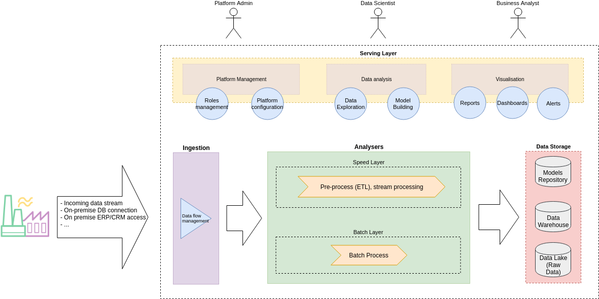

FADI User guide
=========

This page provides documentation on how to use the FADI big data framework.

1. Install FADI
--------

To install the FADI framework locally, see https://github.com/cetic/fadi/INSTALL.md

2. Ingest data and store it into the datalake
-------

> "An easy to use, powerful, and reliable system to process and distribute data."

[Apache Nifi](http://nifi.apache.org/) provides ingestion mechanism (to e.g. connect a database for ingestion):

