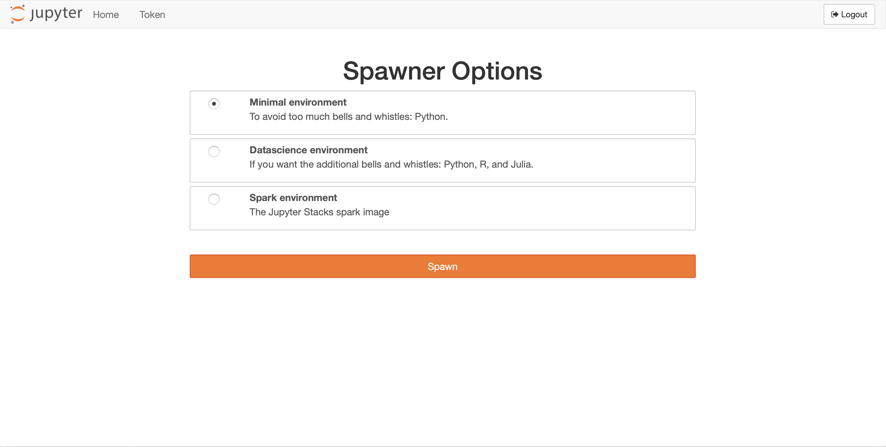

FADI User guide
=========

This page provides documentation on how to use the FADI big data framework using a sample use case: monitoring CETIC offices building.

 * [1. Install FADI](#1-install-fadi)
 * [2. Prepare the database to store measurments](#2-prepare-the-database-to-store-measurments)
 * [3. Ingest measurements](#3-ingest-measurements)
 * [4. Display dashboards and configure alerts](#4-display-dashboards-and-configure-alerts)
 * [5. Explore](#5-explore)
 * [6. Process](#6-process)
 * [7. Summary](#7-summary)


In this simple example, we will ingest temperature measurements from sensors, store them and display them in a simple dashboard.

## 1. Install FADI

To install the FADI framework on your workstation or on a cloud, see the [installation instructions](INSTALL.md). 

The components needed for this use case are the following:

* Apache Nifi as a integration tool to ingest the sensor data from the data source (a csv file in this case) and store it in the database
* PostgreSQL as both a datawarehouse and datalake
* Gafana as a dashboard tool to display graphs from the data ingested and stored in the datalake

Those components are configured in the following [sample config file](helm/deploy.sh), once the platform is ready, you can start working with it. The following instructions assume that you deployed FADI on your workstation inside minikube.

## 2. Prepare the database to store measurments 

<a href="https://www.pgadmin.org" alt="pgAdmin"></a>

First, setup the datalake by creating a table in the postgresql database. 

To achieve this you need to: 

* Head to the pgadmin interface, if you are using **minikube**, you can use the following command :
```
minikube service -n fadi fadi-pgadmin 
```

* Access to the pgadmin service using the following credentials:
    * login: `pgadmin4@pgadmin.org`
    * password: `admin`

* Get the database password:

```
export POSTGRES_PASSWORD=$(kubectl get secret --namespace fadi fadi-postgresql -o jsonpath="{.data.postgresql-password}" | base64 --decode)
echo $POSTGRES_PASSWORD
```
* Save the shown password to use it later. 

* In pgadmin Browser, create a server on pgadmin by right-click on `Servers` -> `Create a Server`

* Configure the server as shown in the following screenshot. 
    * The `password` field should be completed by the one shown previously (with the `echo` command).


* Launch the Query tool.


* Copy/Paste the [table creation script](examples/basic/create_datalake_tables.sql) in the Query Editor. 


* Execute the creation query by clicking on the `Execute/Refresh` command. 


* Once the previous steps are finished, you can detect that a new table `example_basic` is created in the `Tables` field of pgadmin Browser. 

## 3. Ingest measurements 

<a href="http://nifi.apache.org/" alt="Apache Nifi"></a>

> "An easy to use, powerful, and reliable system to process and distribute data."

[Apache Nifi](http://nifi.apache.org/) provides ingestion mechanism (to e.g. connect a database, REST API, csv/json/avro files on a FTP, ... for ingestion): in this case we want to read the temperature sensors data from our HVAC system and store it in a database.

Temperature measurements from the last 5 days (see [HVAC sample temperatures csv extract](examples/basic/sample_data.csv)) are ingested:

```csv
measure_ts,temperature
2019-06-23 14:05:03.503,22.5
2019-06-23 14:05:33.504,22.5
2019-06-23 14:06:03.504,22.5
2019-06-23 14:06:33.504,22.5
2019-06-23 14:07:03.504,22.5
2019-06-23 14:07:33.503,22.5
2019-06-23 14:08:03.504,22.5
2019-06-23 14:08:33.504,22.5
2019-06-23 14:09:03.503,22.5
2019-06-23 14:09:33.503,22.5
2019-06-23 14:10:03.503,22.5
2019-06-23 14:10:33.504,22.5
2019-06-23 14:11:03.503,22.5
2019-06-23 14:11:33.503,22.5
2019-06-23 14:12:03.503,22.5
2019-06-23 14:12:33.504,22.5
2019-06-23 14:13:03.504,22.5
2019-06-23 14:13:33.504,22.5
2019-06-23 14:14:03.504,22.5
(...)
```

To start, head to the Nifi web interface, if you are using **minikube**, you can use the following command :
```
minikube service -n fadi fadi-nifi
```


Now we need to tell Nifi to read the csv file and store the measurements in the data lake. 

So, create the following components : 

* InvokeHTTP processor:
    * right-click > `Configure` > `Settings` tab > `Automatically Terminate Relationships` : all except `Response`
    *  right-click > `Configure` > `Properties` tab > Remote url: `https://raw.githubusercontent.com/cetic/fadi/master/examples/basic/sample_data.csv`
* PutDatabaseRecord processor:
    * right-click > `Configure` > `Settings` tab > `Automatically Terminate Relationships` : all
    * right-click > `Configure` > `Properties` tab  > Record Reader: `CSV Reader`
        * `Go To` > `Configure` > `Properties` > 
            * Treat First Line as Header: `true`
            * Enable service by clicking on the lightning icon.
    * right-click > `Configure` > `Properties` tab  > Statement Type: `INSERT`
    * right-click > `Configure` > `Properties` tab  > Database Connection Pooling Service > DBCPConnectionPool
        * `Go To` > `Configure` > `Properties` > 
            * Database Connection URL: `jdbc:postgresql://fadi-postgresql:5432/postgres?stringtype=unspecified`
            * Database Driver Class Name: `org.postgresql.Driver`
            * Database Driver Location(s): `/opt/nifi/psql/postgresql-42.2.6.jar`
            * Database User: `postgres`
            * Password: set to the postgresql password obtained above
            * Enable service by clicking on the lightning icon.
    * right-click > `Configure` > `Properties` tab  > Schema Name > `public`
    * right-click > `Configure` > `Properties` tab  > Table Name > `example_basic`
    * right-click > `Configure` > `Properties` tab  > Translate Field Names > `false`
* Response Connection:
    * Create an edge from `InvokeHTTP` processor to `PutDatabaseRecord`
    * Details > For relationships > `Response`
    
* Output Port:
    * Port Name > : `success_port`     

* Output Port:
    * Port Name > : `failure_port`   

* `Success` Connection:
    * Create an edge from `PutDatabaseRecord` to `Output Success Port`  
    * Details > relationships > only `success`    
    
* `Failure` Connection:
    * From `PutDatabaseRecord` to `Output Failure Port`
    * Details > relationships > : only `failure`   
    
* Recursive Connection on `DatabaseRecord`:
    * Details > relationships > only `retry`   


See also [the nifi template](/examples/basic/basic_example_final_template.xml) that corresponds to this example. 
* Do not forget to update the `password` field in the imported template.

For more information on how to use Apache Nifi, see the [official Nifi user guide](https://nifi.apache.org/docs/nifi-docs/html/user-guide.html) and this [Awesome Nifi](https://github.com/jfrazee/awesome-nifi) resources.

finally, **start** the nifi flow in the **operate** window. 

nb : Don't forget to stop the flow after few secondes, else you will end up with a huge amount of data and this is not essential in this use case.

## 4. Display dashboards and configure alerts

Once the measurements are stored in the database, we will want to display the results in a dashboard.

<a href="https://grafana.com/" alt="Grafana"></a>

> "Grafana allows you to query, visualize, alert on and understand your metrics no matter where they are stored. Create, explore, and share dashboards with your team and foster a data driven culture."

[Grafana](http://grafana.com/) provides a dashboard and alerting interface.

Head to the Grafana interface, if you are using **minikube**, you can use the following command :
```
minikube service -n fadi fadi-grafana
``` 
(the default credentials are `admin`/`password1`)


First we will define the postgresql datasource:


* host: fadi-postgresql:5432
* database: postgres
* user: postgres
* password: set to the postgresql password obtained above
* disable ssl

Then we will configure a simple dashboard that shows the temperatures over the last week:


And finally we will configure some alerts using very simple rules:


For more information on how to use Grafana, see the [official Grafana user guide](https://grafana.com/docs/guides/getting_started/)

## 5. Explore

<a href="https://superset.incubator.apache.org/" alt="Superset"></a>

> "BI tool with a simple interface, feature-rich when it comes to views, that allows the user to create and share dashboards. This tool is simple and doesn’t require programming, and allows the user to explore, filter and organise data."

[Apache Superset](https://superset.incubator.apache.org) provides some interesting features to explore your data and build basic dashboards.

Head to the Superset interface,  if you are using **minikube**, you can use the following command :
```
minikube service -n fadi fadi-superset
``` 
(the default credentials are `admin`/`password1`): 

First we will define the datasource:

* On the top menu of Superset, click on `Sources` -> `Databases`

* Then, on the right, click on (+) (`add a new record` button).
    * Database: `example_basic`
    * SQLAlchemy URI: `postgresql://postgres:<your_password>@fadi-postgresql:5432/postgres`

* Finally, you can click on `Test Connection` to check to connection to the database.


* Once the database is created, we can now create a table. 
    * On the top menu of Superset, click on `Sources` -> `Tables`
    * Click on (+) (`add a new record` button).
    * Database: select `example_basic`. 
    * Table name: `example_basic`.
    * Click `Save`.
    * On the table `example_basic`, click `Edit record` button.
    * On the `List Columns` tab, in the `measure_ts`, click on the `Edit record` button. 
    * In the "Expression" box, enter `measure_ts ::timestamptz`.
    * Click `Save`.


  
Then we will explore our data and build a simple dashboard with the data that is inside the database:

* On the top menu of Superset, click on `Charts` 
* Click on (+) (`add a new record` button).
* Choose a datasource: select `example_basic`. 
* Choose a visualization type: `Time Series - Line Chart`.
* Click `Create new chart`.
* In the `Data` tab 
    * in `Time` section, 
       * Time Grain: `hour`.
       * Time range: `Last quarter`
    * in `Query` section
       * Metrics: `AVG(temperature)`
       * Click `Save`
* Then, in the main window of the dashboad, click on `Run Query`.

A diagram will be shown.

* We can now save the dashboard, by clicking on `Save`.
   * Save as: `Basic example`
   * Add to new dashboard: `Basic example dashboard`
   * Click on `Save & go to bashboard`.
    


For more information on how to use Superset, see the [official Superset user guide](https://superset.incubator.apache.org/tutorial.html)

## 6. Process

<a href="https://spark.apache.org/" alt="Apache Spark"></a>

> "Apache Spark™ is a unified analytics engine for large-scale data processing."

[Jupyter](https://jupyter.org/) notebooks provide an easy interface to the [Spark](https://spark.apache.org/) processing engine that runs on your cluster.

In this simple use case, we will try to access the data that is stored in the data lake.

Head to the Jupyter notebook interface,  if you are using **minikube**, you can use the following command : 
```
minikube service -n fadi proxy-public
```  
(the default credentials are `admin`/`password1`):



Do some data exploration in the notebook, load the [sample code](examples/basic/jupyter_exporation.ipynb):


Do some Spark processing in the notebook, load the [sample code](examples/basic/jupyter_spark.ipynb):


For more information on how to use Superset, see the [official Jupyter documentation](https://jupyter.readthedocs.io/en/latest/)

## 7. Summary

In this use case, we have demonstrated a simple configuration for FADI, where we use various services to ingest, store, analyse, explore and provide dashboards and alerts 

You can find the various resources for this sample use case (Nifi flowfile, Grafana dashboards, ...) in the [examples folder](examples/basic)
