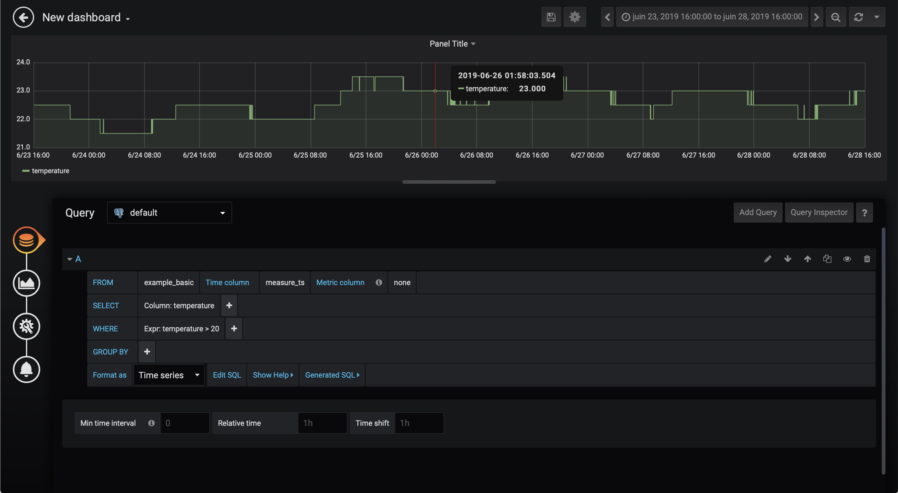

FADI User guide
=========

This page provides documentation on how to use the FADI big data framework.

A sample use case - Building monitoring at CETIC offices
---------------


In this simple example, we will ingest temperature measurements from sensors, store them and display them in a simple dashboard.

### 1. Install FADI

To install the FADI framework on your workstation or on a cloud, see the [installation instructions](INSTALL.md). 

The components needed for this use case are the following:

* Apache Nifi as a integration tool to ingest the sensor data from the data source (a csv file in this case) and store it in the database
* PostgreSQL as both a datawarehouse and datalake
* Gafana as a dashboard tool to display graphs from the data ingested and stored in the datalake

Those components are configured in the following [sample config file](helm/deploy.sh), once the platform is ready, you can start working with it. The following instructions assume that you deployed FADI on your workstation inside minikube.

### 2. Ingest and store measurements 

<a href="http://nifi.apache.org/" alt="Apache Nifi"></a>

> "An easy to use, powerful, and reliable system to process and distribute data."

[Apache Nifi](http://nifi.apache.org/) provides ingestion mechanism (to e.g. connect a database, REST API, csv/json/avro files on a FTP, ... for ingestion): in this case we want to read the temperature sensors data from our HVAC system and store it in a database.

Temperature measurements from the last 5 days (see [HVAC sample temperatures csv extract](examples/basic/sample_data.csv)) are ingested:

```csv
(...)
23.5,1561467513.503
23.5,1561467543.504
23.5,1561467573.503
23.5,1561467603.504
23.5,1561467633.504
23.5,1561467663.503
23.5,1561467693.503
23,1561467723.504
23,1561467753.503
23,1561467783.504
23,1561467813.504
23,1561467843.503
23.5,1561467873.503
23.5,1561467903.504
23.5,1561467933.503
23.5,1561467963.503
23.5,1561467993.504
(...)
```

First, head to the Nifi web interface, if you are using the local installation with Minikube you can run the following command:

 ```
 minikube service fadi-nifi-load-balancer -n fadi
 ```


Now we need to tell Nifi to read the csv file and store the measurements in the data lake:


For more information on how to use Apache Nifi, see the [official Nifi user guide](https://nifi.apache.org/docs/nifi-docs/html/user-guide.html) and this [Awesome Nifi](https://github.com/jfrazee/awesome-nifi) resources.

### 3. Display dashboards and configure alerts

Once the measurements are stored in the database, we will want to display the results in a dashboard.

<a href="https://grafana.com/" alt="Grafana"></a>

> "Grafana allows you to query, visualize, alert on and understand your metrics no matter where they are stored. Create, explore, and share dashboards with your team and foster a data driven culture."

[Grafana](http://grafana.com/) provides a dashboard and alerting interface.

Head to the Grafana interface (the default credentials are `admin`/`password`): 

```minikube service fadi-grafana -n fadi```


First we will define the datasource:


Then we will configure a simple dashboard that shows the temperatures over the last week:



And finally we will configure some alerts using very simple rules:


For more information on how to use Grafana, see the [official Grafana user guide](https://grafana.com/docs/guides/getting_started/)

### 4. Explore

<a href="https://superset.incubator.apache.org/" alt="Superset"></a>

> "BI tool with a simple interface, feature-rich when it comes to views, that allows the user to create and share dashboards. This tool is simple and doesn’t require programming, and allows the user to explore, filter and organise data."

[Apache Superset](https://superset.incubator.apache.org) provides some interesting features to explore your data and build basic dashboards.

Head to the Superset interface (the default credentials are `admin`/`admintest`): 

```minikube service fadi-superset -n fadi```


First we will define the datasource:


Then we will explore our data and build a simple dashboard with the data that is inside the database:


For more information on how to use Superset, see the [official Superset user guide](https://superset.incubator.apache.org/tutorial.html)

### 5. Process

<a href="https://superset.incubator.apache.org/" alt="Superset"></a>

> "BI tool with a simple interface, feature-rich when it comes to views, that allows the user to create and share dashboards. This tool is simple and doesn’t require programming, and allows the user to explore, filter and organise data."

<a href="https://spark.apache.org/" alt="Apache Spark"></a>

> "Apache Spark™ is a unified analytics engine for large-scale data processing."

[Jupyter](https://jupyter.org/) notebooks provide an easy interface to the [Spark](https://spark.apache.org/) processing engine that runs on your cluster.

In this simple use case, we will try to access the data that is stored in the data lake.

Head to the Jupyter notebook interface (the default credentials are `admin`/`password`): 

```minikube service proxy-public -n fadi```


Do some data exploration in the notebook, load the [sample code](examples/basic/jupyter_exporation.ipynb):


Do some Spark processing in the notebook, load the [sample code](examples/basic/jupyter_spark.ipynb):


For more information on how to use Superset, see the [official Jupyter documentation](https://jupyter.readthedocs.io/en/latest/)

### 6. Summary

In this use case, we have demonstrated a simple configuration for FADI, where we use various services to ingest, store, analyse, explore and provide dashboards and alerts 

You can find the various resources for this sample use case (Nifi flowfile, Grafana dashboards, ...) in the [examples folder](examples/basic)