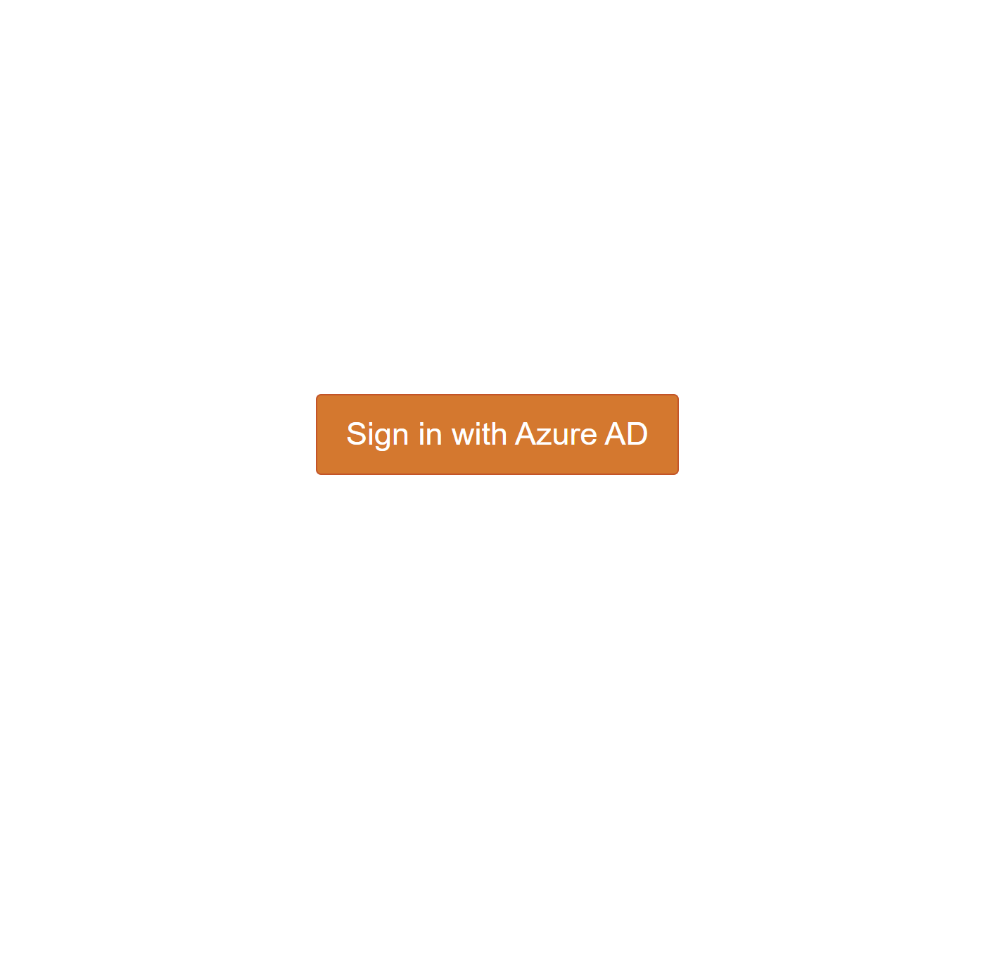
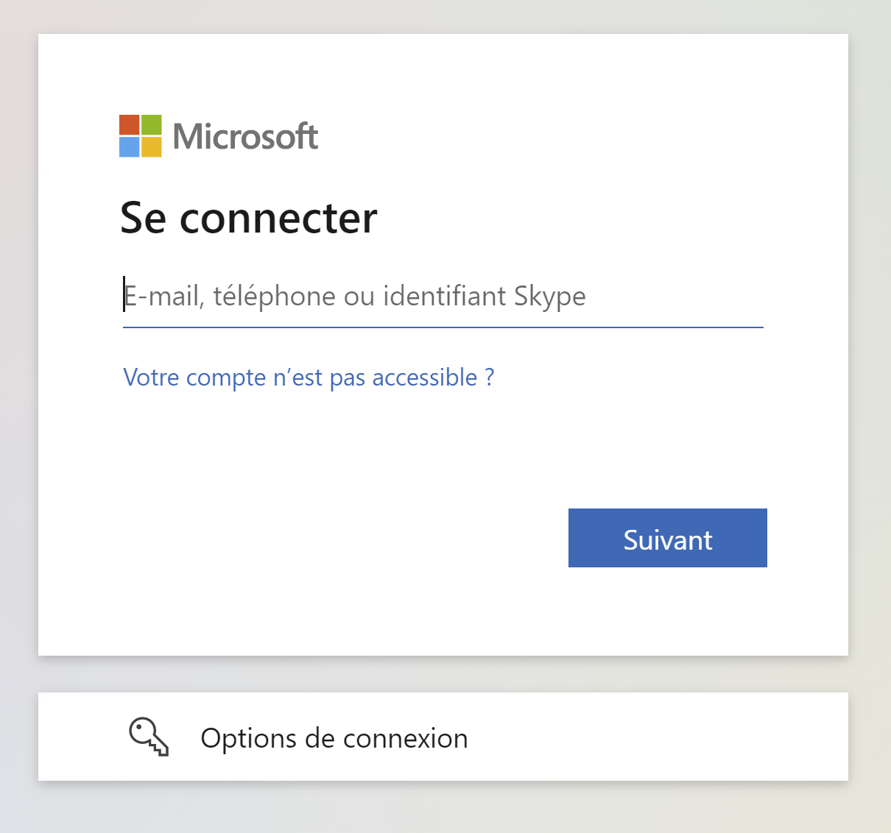

Azure AD authentication and authorization
==========

[Azure AD](https://docs.microsoft.com/en-us/azure/active-directory/fundamentals/active-directory-whatis) provides a service to manage access and identities through the Azure Cloud.

In this document, we will explain how to access three of FADI applications (Grafana, Jupyterhub and Nifi) by using Azure AD as an ID Provider.

This guide assumes that you know how to [install](/INSTALL.md) FADI and enable [Traefik ingress](REVERSEPROXY.md). It also assume that you know how to enable [TLS](SECURITY.md) because it is needed.

## 1. App registrations

Before setting up FADI's app, we need to use an Azure service called [Application Registrations](https://docs.microsoft.com/en-us/azure/active-directory/develop/quickstart-register-app). The purpose of this registration is to establish a trust relationship between your application and Azure AD.

In our case, we will only use one "application registration" which will be used for all three applications (Grafana, Jupyterhub and Nifi).

To do this, you can follow this [official tutorial](https://docs.microsoft.com/en-us/azure/active-directory/develop/quickstart-register-app). Choose a descriptive name for the app registration like "FADI" and save. Add a Web platform, you will add the redirect URIs later. Finally, add a "client secret" credential type and set a name and an expiration date.

Once the application is registered, write down the `Application ID`, `Tenant ID` and `Client Secret` values. These will be used for FADI application configurations.

## 2. App configurartions

### 2.1. Grafana

In the FADI Helm chart `values.yaml` file, navigate to the `auth.azuread` part of the `grafana` section. Next, set the following configuration:

```yaml
auth.azuread:
    name: Azure AD
    enabled: true
    allow_sign_up: true
    client_id: <your_application_id> 
    client_secret: <your_client_secret_value>
    scopes: openid email profile
    auth_url: https://login.microsoftonline.com/<your_tenant_id>/oauth2/v2.0/authorize
    token_url: https://login.microsoftonline.com/<your_tenant_id>/oauth2/v2.0/token
    allowed_domains:
    allowed_groups:
server:
    root_url: <your_grafana_domain_name>
```

> Note that the `root_url` must be the same that the domain name set in the [IngressRoute](REVERSEPROXY.md).

If Grafana is already deployed (refer [here](../INSTALL.md#122-install-fadi-services-on-the-local-cluster) for the installation), type:

```
helm upgrade fadi <fadi_folder>
```

else:

```
helm install fadi <fadi_folder>
```

Now, you can add a redirect URI in the `platform` of your `app registration`:

```
https://<your_grafana_domain_name>/login/azuread
```

Type the Grafana domain name in your browser and you will see a new field to sign in with Microsoft:


Click on this field and you will be redirect to the Azure AD sign in page or to Grafana if you already are connected.

You can find [here](https://grafana.com/docs/grafana/latest/auth/azuread/) the Grafana official instructions to set Azure AD authentication or you can also follow [this tutorial](https://martinjt.me/2021/04/10/grafana-on-azure-azuread-authentication/).

### 2.2. JupyterHub

In the FADI Helm chart `values.yaml` file, navigate to the `hub.config` part of the `Jupyterhub` section. Next, uncomment the block of Azure AD authentication and set the following configuration:

```
AzureAdOAuthenticator:
    client_id: <your_application_id>
    client_secret: <your_client_secret_value>
    oauth_callback_url: https://<your_jupyterhub_domain_name>/hub/oauth_callback
    tenant_id: <your_tenant_id>
JupyterHub:
    authenticator_class: azuread
```

> Note that the domain name must be the same that the domain name set in the [IngressRoute](REVERSPROXY.md).

If JupyterHub is already deployed (refer [here](../INSTALL.md#122-install-fadi-services-on-the-local-cluster) for the installation), type:

```
helm upgrade fadi <fadi_folder>
```

else:

```
helm install fadi <fadi_folder>
```

Now, you can add a redirect URI in the `platform` of your `app registration`:

```
https://<your_jupyterhub_domain_name>/hub/oauth_callback
```

Type the JupyterHub domain name in your browser and you will see this field:



Click on this field and you will be redirect to the Azure AD sign in page or to JupyterHub if you already are connected.

You can find [here](https://zero-to-jupyterhub.readthedocs.io/en/latest/administrator/authentication.html#azure-active-directory) the JupyterHub official instructions to set Azure AD authentication or you can also follow [this tutorial](https://martinjt.me/2021/04/10/grafana-on-azure-azuread-authentication/).

### 2.3. NiFi

In the FADI Helm chart `values.yaml` file, navigate to the `auth.oidc` part of the `nifi` section. Next, set the following configuration:

```
auth.oidc:
    enabled: true
    discoveryUrl: https://login.microsoftonline.com/<your_tenant_id>/v2.0/.well-known/openid-configuration
    clientId: <your_application_id>
    clientSecret: <your_client_secret>
    claimIdentifyingUser: email
    admin: <your_admin_email>
```

If NiFi is already deployed (refer [here](../INSTALL.md#122-install-fadi-services-on-the-local-cluster) for the installation), type:

```
helm upgrade fadi <fadi_folder>
```

else:

```
helm install fadi <fadi_folder>
```

Now, you can add a redirect URI in the `platform` of your `app registration`:

```
https://<your_nifi_domain_name>/nifi-api/access/oidc/callback
```

Type the NiFi domain name in your browser and if you are not yet connect to your Azure AD account, you will automaticaly redirect to the Microsoft sign in page:



Enter your AzureAD credentials and you will be redirect to the NiFi home page.
