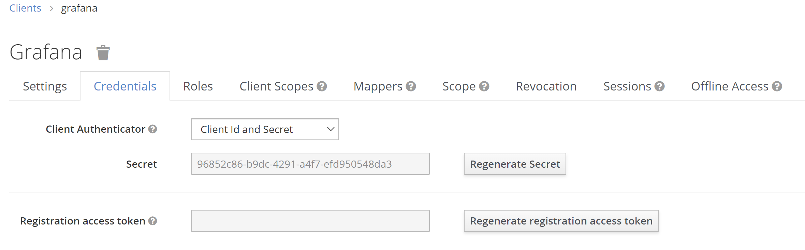
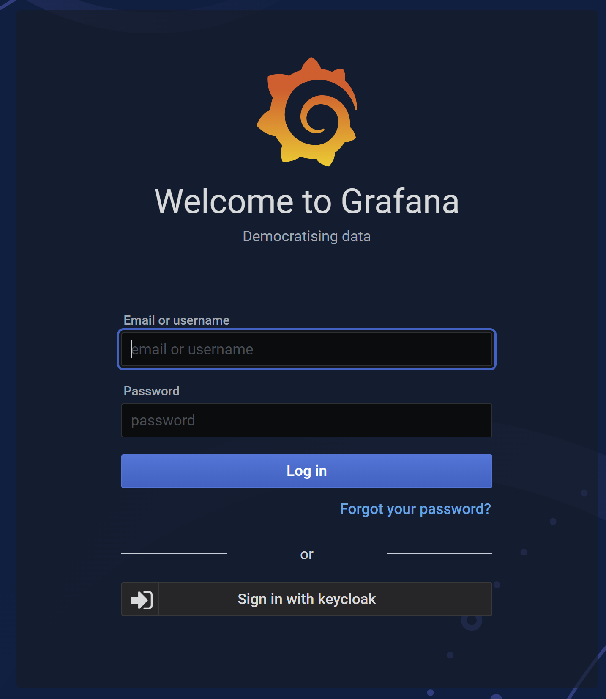
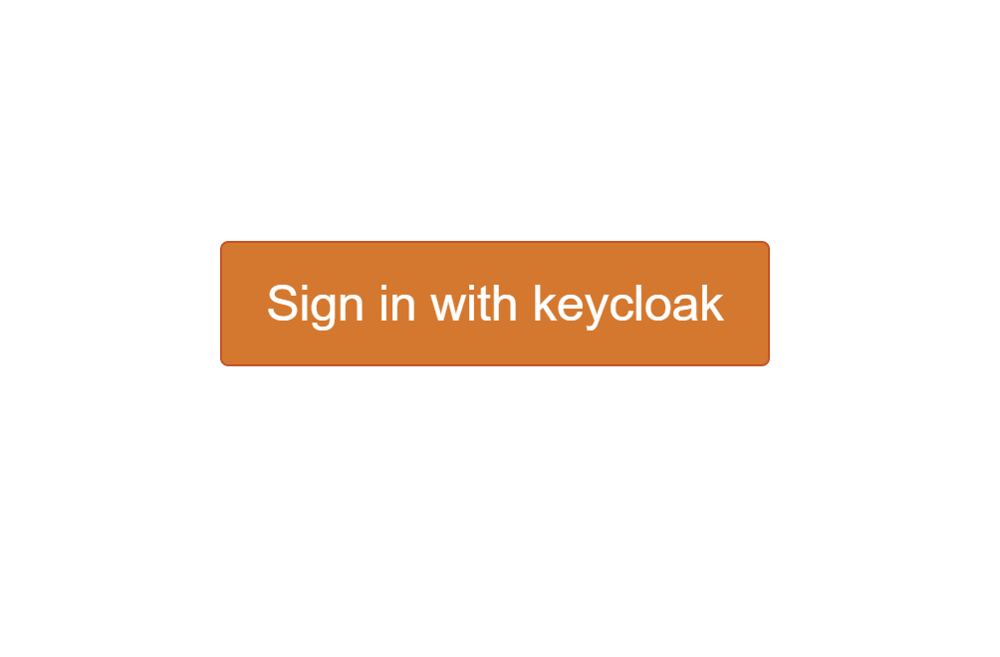

Identity and Access Management - Keycloak
=============

<a href="https://www.keycloak.org/" alt="Keycloak"> </a>

> "[Keycloak](https://www.keycloak.org/) is an open source Identity and Access Management solution aimed at modern applications and services. It makes it easy to secure applications and services with little to no code."

## 1. Configure Keycloak

Keycloak is first deployed with one admin user that we need to configure before deployment, to do so we need to pass the username/password in the `values.yaml` file like follows:

```yaml
keycloak:
  enabled: true
  auth:
    createAdminUser: true
    adminUser: admin
    adminPassword: "password1"
```

Once Keycloak is deployed, we can access the user interface and log in: 


We click on `administration console` then we log in using the credentials we configured above.


### Create realm

When you log in to the admin console, you work in a realm, which is a space where you manage objects. Two types of realms exist:

* **Master realm** - This realm was created for you when you first started Keycloak. It contains the admin account you created at the first login. You use this realm only to create other realms.
* **Other realms** - These realms are created by the admin in the master realm. In these realms, administrators create users and applications. The applications are owned by the users.


To create a realm, head to the Master menu, click `Add Realm`. When you are logged in to the master realm, this menu lists all other realms, then type for example `devops` in the Name field to name our new realm `devops`.


When we click `Create`, the main admin console page opens with realm set to devops, now we can switch between managing the master realm and the realm we just created by clicking entries in the `Select realm` drop-down list.


### Create grafana client

To create clients we first click `Clients` in the **left side menu** to open the Clients page.


On the right side, we click `Create` and then on the `Add Client` dialog, we create a client called `Grafana` by filling the fields as follows:

* Client ID: `grafana`
* Root URL: `\<your-grafana-address>`, for this example our grafana adress is http://grafana.example.cetic.be


Once the client is created, we open the client configuration and change the **access type** to **confidential** from public, and complete the rest of the fields as shown below assuming our Grafana address is http://grafana.example.cetic.be, then we **Save the config**.


Now we open the client Grafana again, go to **credentials tag** and copy the `client id` and `secret` because we are going to need them to configure Grafana later.




### Create NiFi client

Repeat the same steps as Grafana and replace the appropriate fields as follows :

* Client ID: `nifi`
* Root URL: `\<your-nifi-address>`, for this example our grafana address is https://nifi.example.cetic.be (for NiFi, don't forget the "s" in https)

### Create Jupyterhub client

Repeat the same steps as Grafana and replace the appropriate fields as follows :

* Client ID: `jupyterhub`
* Root URL: `\<your-jupyterhub-address>`, for this example our grafana adress is https://jupyterhub.example.cetic.be

### Create user

In the `devops` realm, we need to create a new user and a password for that new user, we head to the left menu, click `Users` to open the user list page.


On the right side of the empty user list, click `Add User` to open the Add user page.


We enter a name in the `Username` field (this is the only required field), then we flip the `Email Verified` switch to `On` and click `Save`.


The management page for the new user opens, we click the **Credentials tab** to set a password for the new user, we type a new password and confirm it. For this example, we deactivate the temporary option.


Then we Click **Set Password** to set the user password to the new one we specified.

### Role mapping

After creating the user we need to map this user to the Grafana client we created earlier.

First we head to the clients page and choose Grafana, then  we click the **Roles tab** and then click `add Role`:


We fill in the role name and description then click `Save`.


Now that we have at least one role for Grafana, we map this new role to the user we created earlier so we can log in using the new user.

Now we head back to the Users page and chose `john`, then we click the **Role mappings** tab, in **client role** dropdown menu we choose `grafana`.


Then we can find the role admin that we created, we **select admin** and then click **add selected**.

## 2. Integrate Keycloak with the services

### Integrate with Grafana

After creating the client in Keycloak we have to configure Grafana to use openid connect and connect it to Keycloak, we do so in Grafana's **grafana.ini** file that we can configure in the **helm chart's values file** [values.yaml](https://github.com/cetic/helm-fadi/blob/master/values.yaml).

Now to configure Grafana we edit as below: 

* `devops` is the realm name, client id is the client name and client secret the **previously copied code**, in this example **keycloak's address** is **http://keycloak.example.cetic.be**. 
* `client_secret` with Keycloak > Clients > Grafana > Credentials > Secret

```
grafana:
---
  grafana.ini:
---
    auth.generic_oauth:
      enabled: true
      scopes: openid email profile
      name: keycloak
      tls_skip_verify_insecure: false
      allow_sign_up: true
      client_id: grafana
      client_secret: cfcb88cb-78c5-4301-9ffd-e9779d7d8c5e
      auth_url: http://keycloak.example.cetic.be/auth/realms/devops/protocol/openid-connect/auth
      token_url: http://keycloak.example.cetic.be/auth/realms/devopsr/protocol/openid-connect/token
      api_url: http://keycloak.example.cetic.be/auth/realms/devops/protocol/openid-connect/userinfo
      ---
    server:
      root_url: http://grafana.example.cetic.be  # change to your grafana domain name
```

After configuring Grafana we need to apply these modifications:

```bash
helm upgrade --install fadi .
```

Once FADI is updated, Grafana will restart with our new configuration, now we can head to our Grafana and we should notice that we have the option **Sign in with keycloak** which is the option we are going to choose.



That will take us to a keycloak themed authentification screen, that is where we can authenticate using the **user** that we created earlier in Keycloak and mapped to the Grafana client.


Here we can authenticate using the user email john@mail.com and the password we set up earlier.

This document is inspired by [keycloak's getting started](https://www.keycloak.org/docs/latest/getting_started/) and this [tutorial](https://www.techrunnr.com/how-to-setup-oauth-for-grafana-using-keycloak/).

### Integrate with NiFi

To configure NiFi, we edit [values.yaml](https://github.com/cetic/helm-fadi/blob/master/values.yaml) as below: 


* `client_secret` with Keycloak > Clients > Nifi > Credentials > Secret

```yaml
nifi:
  enabled: true
  ---
  auth:
    ---
    oidc:
      enabled: true
      discoveryUrl: http://keycloak.example.cetic.be/auth/realms/devops/.well-known/openid-configuration
      clientId: nifi
      clientSecret: 49342125-4715-4b1f-8d84-57e20c92db2c
      claimIdentifyingUser: email
      admin: john@mail.com
      ## Request additional scopes, for example profile
      additionalScopes: 
```

After configuring NiFi, we need to apply these modifications:

```bash
helm upgrade --install fadi .
```

Once FADI is updated, NiFi will restart with our new configuration. Now we can head to our NiFi and we will automatically redirect to Keycloak for the authentication.


Here we can authenticate using the user email john@mail.com and the password we set up earlier.

### Integrate with Jupyterhub

To configure Jupyterhub, we edit [values.yaml](https://github.com/cetic/helm-fadi/blob/master/values.yaml) as below: 


* `client_secret` with Keycloak > Clients > Jupyterhub > Credentials > Secret

```yaml
jupyterhub:
  enabled: true
  ---
  hub:
    config:
    ---
      GenericOAuthenticator:
        client_id: jupyterhub
        client_secret: 5677bb90-794e-4cff-a8ef-0586c2df73cf
        oauth_callback_url: http://jupyterhub.example.cetic.be/hub/oauth_callback
        authorize_url: http://keycloak.example.cetic.be/auth/realms/devops/protocol/openid-connect/auth
        token_url: http://keycloak.example.cetic.be/auth/realms/devops/protocol/openid-connect/token
        userdata_url: http://keycloak.example.cetic.be/auth/realms/devops/protocol/openid-connect/userinfo
        login_service: keycloak
        username_key: email
        userdata_params:
          state: state
      JupyterHub:
        authenticator_class: generic-oauth
```

After configuring Jupyterhub, we need to apply these modifications:

```bash
helm upgrade --install fadi .
```

Once FADI is updated, Jupyterhub will restart with our new configuration. We can head to our Jupyterhub and we should notice that we have the option **Sign in with keycloak** which is the option we are going to choose.



That will take us to a Keycloak-themed authentification screen, that is where we can authenticate using the **user** that we created earlier in Keycloak.


Here we can authenticate using the user emal john@mail.com and the password we set up earlier.
