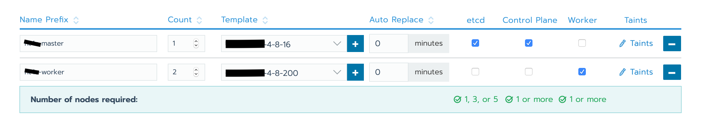
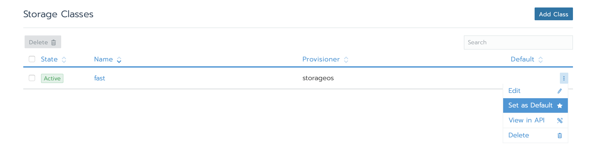

Deploy FADI with rancher and proxmox
=============

* [1. Upload ISO on Proxmox Node](#1-Upload-IS0-on-Proxmox-Node)
* [2. Install Rancher](#2-Install-Rancher)
* [3. Add docker-machine driver](#1-Add-docker-machine-driver)
* [4. Create Cluster With Rancher](#2-Create-Cluster-With-Rancher)
     * [Create Node Template](#Create-Node-Template)
     * [Create Cluster](#Create-Cluster)
     * [Create The Nodes](#Create-The-Nodes)
* [5.Manage the provisioning of the persistent volumes](#5-Manage-the-provisioning-of-the-persistent-volumes)
* [5. Control Cluster from Local PC](#3-Control-Cluster-from-Local-PC)


This page provides information on how to create a kubernetes cluster and deploy FADI using rancher and proxmox.

## 1. Upload ISO on Proxmox Node

<a href="https://www.proxmox.com/" alt="OpenLDAP"> </a>

> "Proxmox VE is a complete open-source platform for enterprise virtualization. With the built-in web interface you can easily manage VMs and containers, software-defined storage and networking, high-availability clustering, and multiple out-of-the-box tools on a single solution."

First you need to download the iso rancheros-proxmoxve-autoformat.iso, you can download by clicking [here](https://github.com/rancher/os/releases/download/v1.5.5/rancheros-proxmoxve-autoformat.iso).

Once downloaded you need to upload on your proxmox node.
## 2. Install Rancher

We consider you have already deploy Rancher. However we give you the instructions that we have followed to deploy our Rancher server : [https://rancher.com/docs/rancher/v2.x/en/installation/other-installation-methods/single-node-docker/advanced/](https://rancher.com/docs/rancher/v2.x/en/installation/other-installation-methods/single-node-docker/advanced/)
## 3. Add docker-machine driver

You need to allow Rancher to control the Proxmox. We have contributed to upgrade a existing docker-machine driver to make it compatible with Rancher.
To add this driver in your Rancher, Follow this steps :


Driver Url:
```
https://github.com/lnxbil/docker-machine-driver-proxmox-ve/releases/download/v3/docker-machine-driver-proxmoxve.linux-amd64
```

## 4. Create Cluster With Rancher

<a href="https://www.proxmox.com/" alt="OpenLDAP"> </a>

> "Rancher is open source software that combines everything an organization needs to adopt and run containers in production. Built on Kubernetes, Rancher makes it easy for DevOps teams to test, deploy and manage their applications."

After connecting to rancher, you can follow the following steps

### Create Node Template
This is where you define the templates you wanna use for your nodes ( both masters and workers ), to do so you can go to: `profile (top right corner)`  > `Node templates` > `Add Template` :

Choose `Proxmoxve`

and then fill the rest of the fields like the IP of the proxmox `i.e. proxmoxHost`, the username/password `i.e. proxmoxUserName, proxmoxUserPassword `, storage of the image file `vmImageFile ` which is in our case `local:iso/rancheros-proxmoxve-autoformat.iso` and coming down to the resources you want to allocate for your node `i.e. nodevmCpuCores, vmMemory, vmStorageSize `.

### Create Cluster

To create your cluster:

 `Cluster`  > `Add Cluster` > `Proxmoxve`

You'll need to give your cluster a name, then specify the nodes in the cluster, at first start with **one master node**, you give it a name, choose the template created earlier for that node and then tick all 3 boxes for `etcd`, `Control Plane` and `Worker`, then choose the kubernetes version and click `create`.

> you'll have to wait the `VM creation`, `the RancherOS install` and `the IP address retrieving`, that might take a while

 Once the master node gets its IP address, go to `Cluster`  > `Edit Cluster` and add another worker node, untick the worker box from the master node and tick it in the new worker node, it should look something like this:
 

If a second (or more) node (master or worker) is needed you can either add another with a different template the same way we just did or you can add as much nodes as you want using the same template by simply going to  `YourCluster` (not global)  > `nodes` > `+` and it will add an other node of the same kind:

 


## 5. Manage the provisioning of the persistent volumes.
### StorageOS
Once all your nodes are up and running, it's time to deploy your services, but before you do you need to set your default PVC for the persistent volumes, to do so we first need to deploy the volume plugin `StorageOS`, go to `YourCluster (not global)`  > `system` > `apps` > `launch` and search for `StorageOS`. make sure all the fields are filled correctly like the following screenshot:


and now, launch it 🚀 .

> "launching apps usually takes several minutes, you're going to need to wait a few minutes till the "

Be Careful this service give the posibility to allocate maximum 50Gi with the basic License.


### Manualy


TBT


### Deploy FADI


 selector set as default the StorageClass
#### Longhorn
7. edit the values yaml of fadi
8. run fadi

## 4. Control Cluster from Local PC
