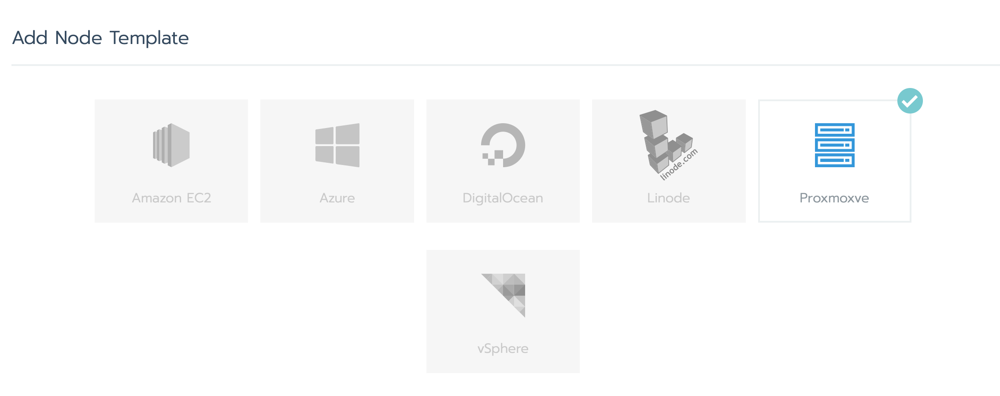
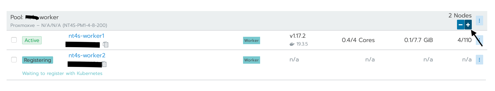
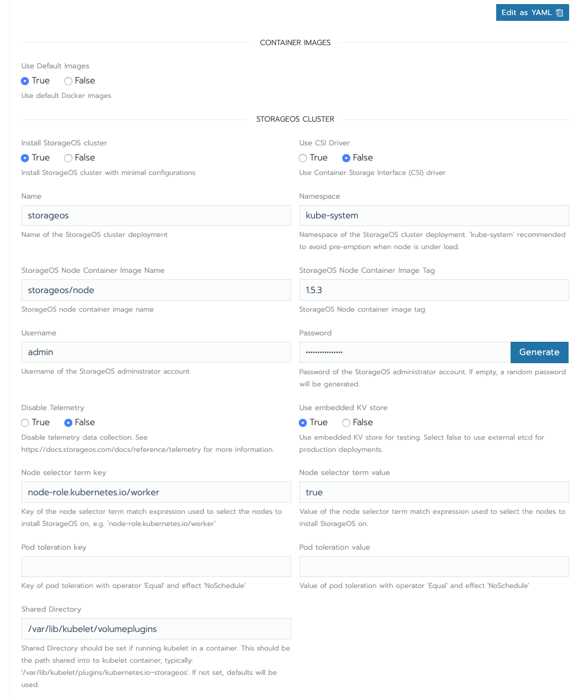
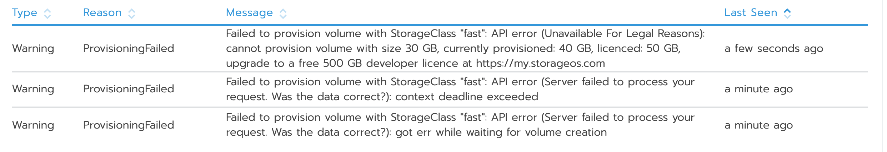
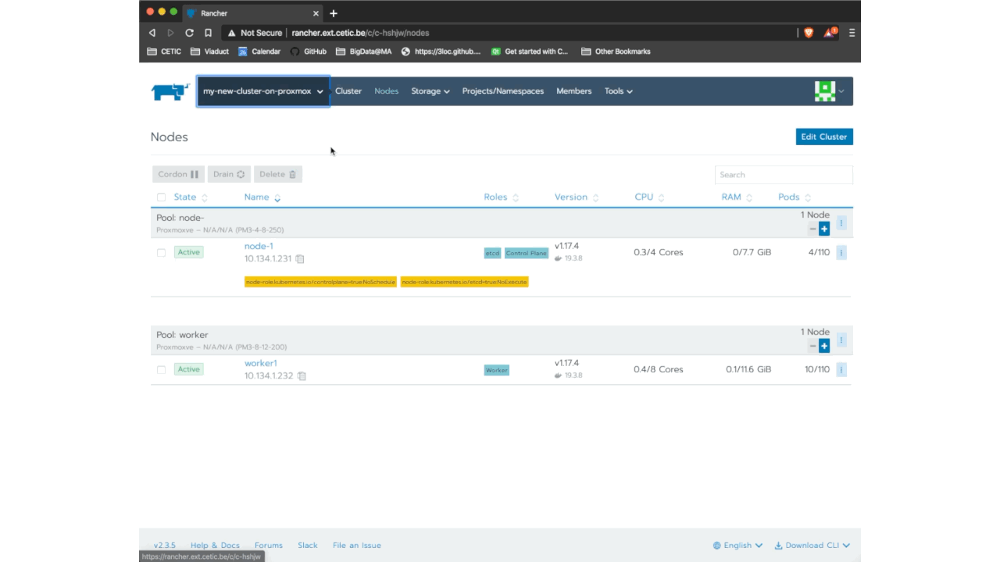
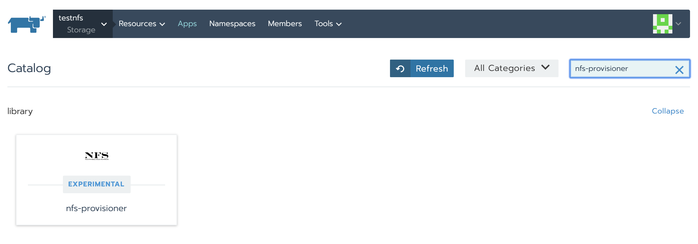
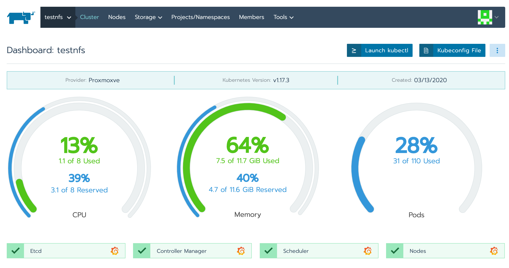
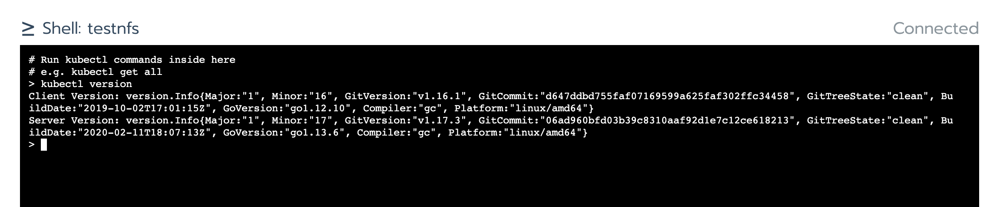

Deploy FADI with Rancher and Proxmox
=============

* [1. Upload ISO on Proxmox Node](#1-Upload-IS0-on-Proxmox-Node)
* [2. Install Rancher](#2-Install-Rancher)
* [3. Add docker-machine driver](#1-Add-docker-machine-driver)
* [4. Create Cluster With Rancher](#2-Create-Cluster-With-Rancher)
     * [Create Node Template](#Create-Node-Template)
     * [Create Cluster](#Create-Cluster)
     * [Create The Nodes](#Create-The-Nodes)
* [5.Manage the provisioning of the persistent volumes](#5-Manage-the-provisioning-of-the-persistent-volumes)
    * [StorageOS](StorageOS)
    * [Longhorn](Longhorn)
    * [NFS Server](NFS-Server)
    * [Manually](Manually)
* [6. Control Cluster from Local PC](#7-Control-Cluster-from-Local-PC)


This page provides information on how to create a kubernetes cluster and deploy FADI using **Rancher** and **Proxmox**. We assume that you have already deploy **Proxmox**.

# 1. Upload ISO on Proxmox Node

<a href="https://www.proxmox.com/" alt="OpenLDAP"> </a>

> *Proxmox VE is a complete open-source platform for enterprise virtualization. With the built-in web interface you can easily manage VMs and containers, software-defined storage and networking, high-availability clustering, and multiple out-of-the-box tools on a single solution.*

First you need to download the iso rancheros-proxmoxve-autoformat.iso, you can download by clicking [here](https://github.com/rancher/os/releases/download/v1.5.5/rancheros-proxmoxve-autoformat.iso).
Once downloaded you need to upload on your proxmox node.

# 2. Install Rancher
<a href="https://www.proxmox.com/" alt="OpenLDAP"> </a>

>*Rancher is open source software that combines everything an organization needs to adopt and run containers in production. Built on Kubernetes, Rancher makes it easy for DevOps teams to test, deploy and manage their applications.*


We consider you have already deploy Rancher. However we give you the instructions that we have followed to deploy our Rancher server : [https://rancher.com/docs/rancher/v2.x/en/installation/other-installation-methods/single-node-docker/advanced/](https://rancher.com/docs/rancher/v2.x/en/installation/other-installation-methods/single-node-docker/advanced/)
# 3. Add docker-machine driver

You need to allow Rancher to control the Proxmox. We have contributed to upgrade a existing docker-machine driver to make it compatible with Rancher.
To add this driver in your Rancher, Follow this steps :


Driver Url:
```
https://github.com/lnxbil/docker-machine-driver-proxmox-ve/releases/download/v3/docker-machine-driver-proxmoxve.linux-amd64
```

# 4. Create Cluster With Rancher
After connecting to rancher, you can follow the following steps :

## Create Node Template
This is where you define the templates you wanna use for your nodes ( both masters and workers ), to do so you can go to: `profile (top right corner)`  > `Node templates` > `Add Template` :

Choose `Proxmoxve`

and then fill the rest of the fields like the IP of the proxmox `i.e. proxmoxHost`, the username/password `i.e. proxmoxUserName, proxmoxUserPassword `, storage of the image file `vmImageFile ` which is in our case `local:iso/rancheros-proxmoxve-autoformat.iso` and coming down to the resources you want to allocate for your node `i.e. nodevmCpuCores, vmMemory, vmStorageSize `.

Be careful, the ssh **sshUsername** and **sshPassword** must be `docker` and `tcuser`

## Create Cluster

To create your cluster go to:

`global`  >  `Cluster`  > `Add Cluster` > `Proxmoxve`

You'll need to give your cluster a name, then specify the nodes in the cluster, at first start with **one master node**, you give it a name, choose the template created earlier for that node and then tick all 3 boxes for `etcd`, `Control Plane` and `Worker`, then choose the kubernetes version and click `create`.

> you'll have to wait the `VM creation`, `the RancherOS install` and `the IP address retrieving`, that might take a while


 Once the master node gets its IP address, go to `Cluster`  > `Edit Cluster` and add another worker node, untick the worker box from the master node and tick it in the new worker node, it should look something like this:

 

If a second (or more) node (master or worker) is needed you can either add another with a different template the same way we just did or you can add as much nodes as you want using the same template by simply going to  `YourCluster` (not global)  > `nodes` > `+` and it will add an other node of the same kind:

All of this steps are taken back in the following animation :

 


# 5. Manage the provisioning of the persistent volumes.
Once all your nodes are up and running, it's time to deploy your services, but before you do you need to set your default PVC for the persistent volumes.

Several ways are possible to manage its aspects. We will describe three of them, and leave it to you to choose the method that best meets your requirements.

## StorageOS
<a href="https://www.storageos.com/" alt="storageos"> </a>
> *StorageOS is a cloud native storage solution that delivers persistent container storage for your stateful applications in production.
Dynamically provision highly available persistent volumes by simply deploying StorageOS anywhere with a single container.*


To deploy the volume plugin `StorageOS`, go to `YourCluster (not global)`  > `system` > `apps` > `launch` and search for `StorageOS`. make sure all the fields are filled correctly like the following screenshot:



and now, launch it 🚀.

A small animation take back this all steps:


launching apps usually takes several minutes, you're going to need to wait a few minutes

StorageOS is a very good turnkey solution. However this service give only the possibility to allocate maximum 50Gi with the basic License.



Finally, all that remains is to define the StorageClass **StorageOS** as the one that will be used by default. To do this, go to `Storage`> `StorageClass` and click on the menu (the three little points on the right side). Now, click on `Set as Default`.

This procedure is shown on the below animation :



## Longhorn
<a href="https://github.com/longhorn/longhorn" alt="longhorn"> </a>

> *Longhorn is a distributed block storage system for Kubernetes.
Longhorn creates a dedicated storage controller for each block device volume and synchronously replicates the volume across multiple replicas stored on multiple nodes. The storage controller and replicas are themselves orchestrated using Kubernetes.*

This tool is really very powerful, based on iSCSI technology. Unfortunately it is not yet supported by RancherOS (The operating system used in this example).

We report the bugs and problems encountered in two opened github issues:

[https://github.com/rancher/os/issues/2937](https://github.com/rancher/os/issues/2937)
[https://github.com/longhorn/longhorn/issues/828](https://github.com/longhorn/longhorn/issues/828)

## NFS Server Provisionner
<a href="https://github.com/longhorn/longhorn" alt="nfs"> </a>

>*The Network File System (NFS) is a client/server application that lets a computer user view and optionally store and update files on a remote computer as though they were on the user's own computer.
NFS Server Provisioner is an out-of-tree dynamic provisioner for Kubernetes. You can use it to quickly & easily deploy shared storage that works almost anywhere.*

This is the last solution that we are trying to master, so we still have very little feedback.

However, it is very easy to deploy and set up. Indeed, our first uses did not require any particular configuration. This plugin supports both the deployment of the NFS server and the management of persistent volumes

One of the limits and caveat would be that the NFS server is attached to a node, if it crashes, it is possible that the data is lost.

To add this plugin to your cluster go to `Apps` and click on `Launch`. On the `Search bar` put `nfs-provisioner`.



Just select the plugin and push and the launch button 🚀.
## Manualy

It is also possible to manually create the persistent volumes, this way of doing offers the advantage of a complete control of the volumes but is very inflexible. If you choose this way of doing things, we refer you to the official documentation of Kubernetes:

[https://kubernetes.io/docs/concepts/storage/volumes/](https://kubernetes.io/docs/concepts/storage/volumes/)

# 6. Control Cluster from Local PC
There are ways to interact with your cluster using the `kubectl` command line tool.

First, **Rancher** offers a restricted terminal where only this tool is available. To access it just go to the monitoring page of your cluster and click on the launch `kubectl` button.





The second approach is to use the `kubectl` tool on your machine. to do so, go to the monitoring page of your cluster again and click on `Kubeconfig File`. Copy and paste all of the informations into the file `~/.kube/config` present on your machine.

#### You can now use your cluster created with rancher and deploy in Proxmox!
