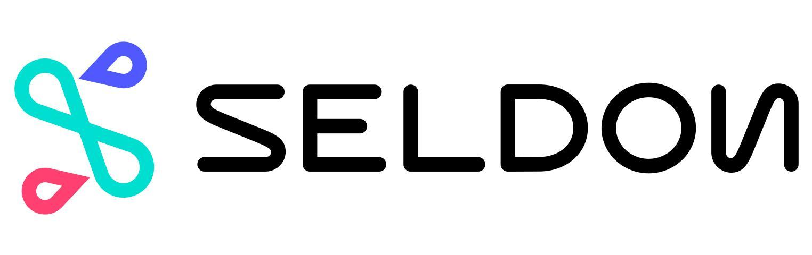

Manage machine learning models with Seldon Core
==========

* [Install Seldon Core service](#install-seldon-core-service)
* [Deploy your model](#deploy-your-model)
    * [1. Package your model](#1-package-your-model)
    * [2. Create your inference graph](#2-create-your-inference-graph)
    * [3. Deploy the model to the Kubernetes cluster](#3-deploy-the-model-to-the-kubernetes-cluster)

<p align="left">
    <a href="https://www.seldon.io/tech/products/core/" title="Seldon Core">
        
    </a>
</p>

[Seldon Core](https://www.seldon.io/tech/products/core/) is an open source platform for deploying machine learning models on a Kubernetes cluster. It extends Kubernetes with **its own custom resource `SeldonDeployment`** where you can define your runtime inference graph made up of models and other components that Seldon will manage.

## Install Seldon Core service
 
To deploy the Seldon Core service inside your FADI installation, set `seldon-core-operator.enabled` option to `true` in your FADI `values.yaml` configuration file and reapply the chart:

```yaml
seldon-core-operator:
  enabled: true
  usageMetrics:
    enabled: false
```

## Deploy your model

### 1. Package your model

To allow your component (model, router etc.) to be managed by Seldon Core it needs to be built into a **Docker container** and to expose the appropriate [service microservice APIs over REST or gRPC](https://docs.seldon.io/projects/seldon-core/en/latest/reference/apis/internal-api.html).

To wrap your model follow the [official Seldon instructions](https://docs.seldon.io/projects/seldon-core/en/v1.1.0/python/index.html).

NB: currently only Python is ready for production use, but other languages ([Java, R, Go, ...](https://docs.seldon.io/projects/seldon-core/en/latest/wrappers/language_wrappers.html)) are compatible.

### 2. Create your inference graph

Seldon Core extends Kubernetes with its own custom resource `SeldonDeployment` where you can define your runtime [inference graph](https://docs.seldon.io/projects/seldon-core/en/latest/graph/inference-graph.html) made up of models and other components that Seldon will manage. 

A `SeldonDeployment` is a JSON or YAML file that allows you to define your graph of component images and the resources each of those images will need to run (using a Kubernetes PodTemplateSpec). Below is a minimal example for a single model,  in YAML:

```yaml
apiVersion: machinelearning.seldon.io/v1alpha2
kind: SeldonDeployment
metadata:
  name: seldon-model
spec:
  name: test-deployment
  predictors:
  - componentSpecs:
    - spec:
        containers:
        - name: classifier
          image: seldonio/mock_classifier:1.0
    graph:
      children: []
      endpoint:
        type: REST
      name: classifier
      type: MODEL
    name: example
    replicas: 1
```

[ref](https://docs.seldon.io/projects/seldon-core/en/v1.1.0/graph/inference-graph.html)

The key components are:

* A list of **`predictors`**, each with a specification for the number of replicas.
    * Each predictor defines a graph and its set of deployments. Having multiple predictors is useful when you want to split traffic between a main graph and a [canary](https://martinfowler.com/bliki/CanaryRelease.html), or for other production rollout scenarios.
* For each predictor, a **list of `componentSpecs`**. Each `componentSpec` is a Kubernetes `PodTemplateSpec` that Seldon will build into a Kubernetes Deployment. Place here the images from your graph and their requirements, e.g. `Volumes`, `ImagePullSecrets`, Resources Requests, etc.
* A **`graph`** specification that describes how the components are joined together.

To understand the inference graph definition in detail see the [Seldon Deployment Reference Types
 reference](https://docs.seldon.io/projects/seldon-core/en/latest/reference/seldon-deployment.html)

### 3. Deploy the model to the Kubernetes cluster

Once the inference graph is created as a JSON or YAML Seldon Deployment resource, you can deploy it to the Kubernetes cluster:

```bash
kubectl apply -f my_deployment.yaml
```

To delete ( or manage ) your `SeldonDeployment` you can use kubectl for the custom resource `SeldonDeployment`, for example to see if there are any models deployed:

```bash
kubectl get seldondeployment
```

To delete the model `seldon-model`:

```bash
kubectl delete seldondeployment seldon-model
```
