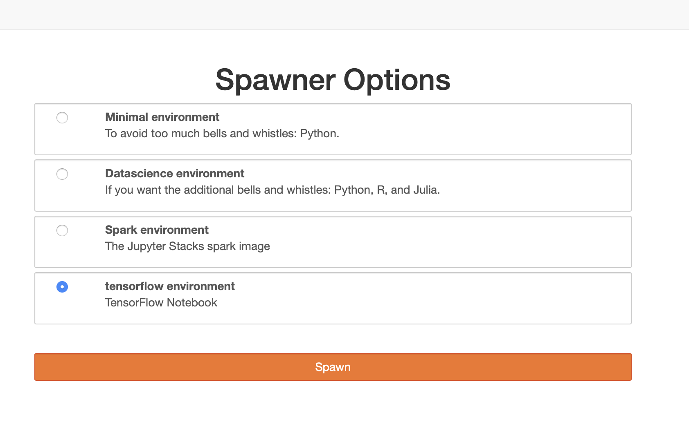
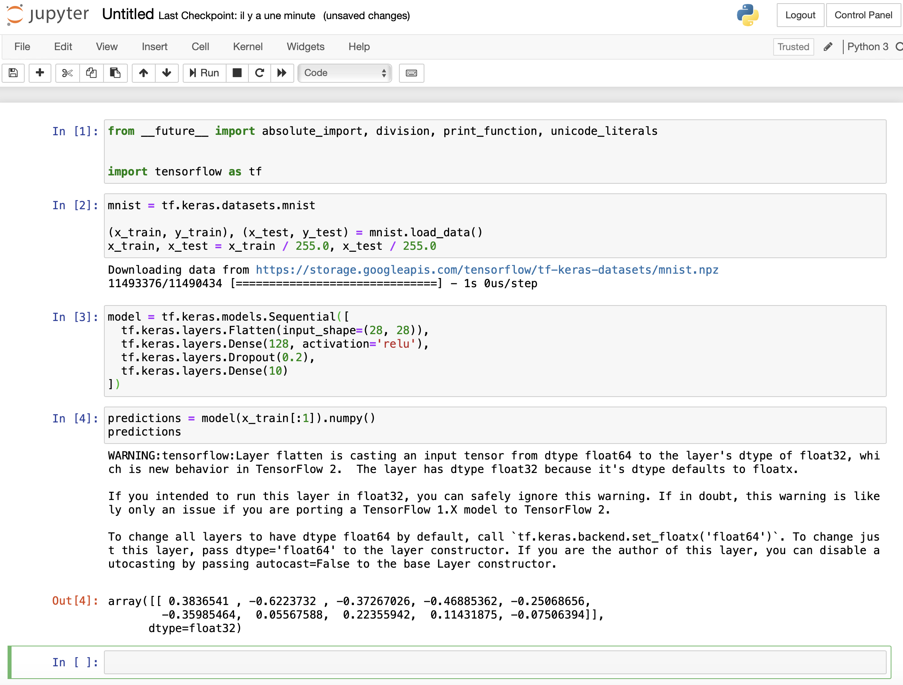
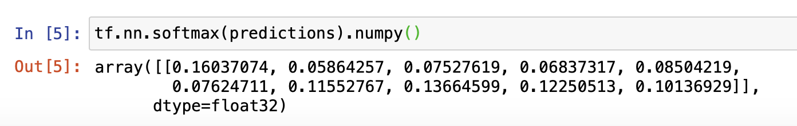
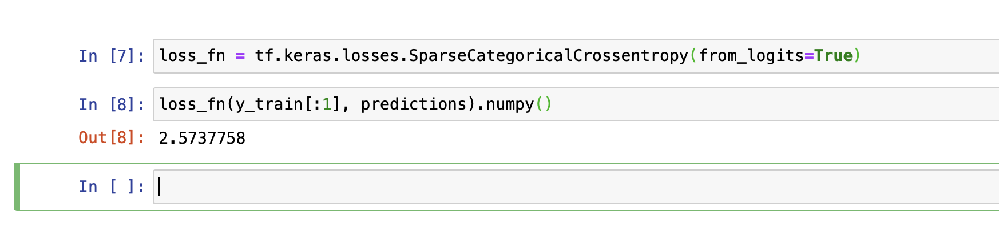
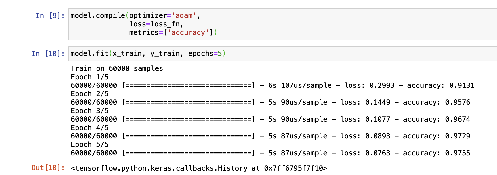
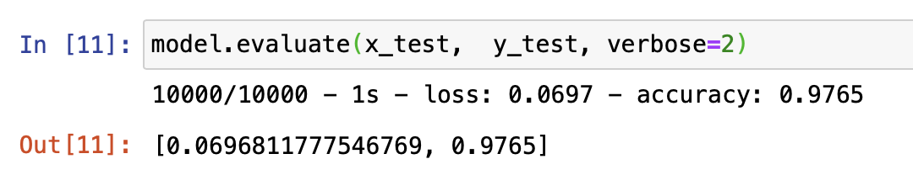
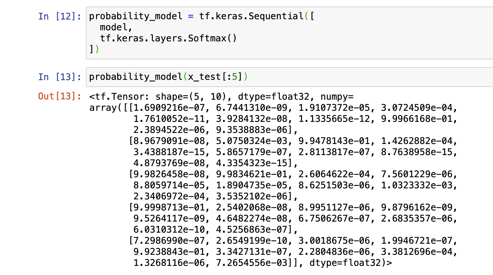

# Tensorflow simple use case

This is a simple Tensorflow use case, first we authenticate to JupyterHub, then we choose the tensorflow envirement and click spawn and we follow the steps. 





* Import TensorFlow:

```
from __future__ import absolute_import, division, print_function, unicode_literals


import tensorflow as tf
```
* Load and prepare the [MNIST](http://yann.lecun.com/exdb/mnist/) dataset. Convert the samples from integers to floating-point numbers:

```
mnist = tf.keras.datasets.mnist

(x_train, y_train), (x_test, y_test) = mnist.load_data()
x_train, x_test = x_train / 255.0, x_test / 255.0
```
* Build the `tf.keras.Sequential` model by stacking layers. Choose an optimizer and loss function for training:

```
model = tf.keras.models.Sequential([
  tf.keras.layers.Flatten(input_shape=(28, 28)),
  tf.keras.layers.Dense(128, activation='relu'),
  tf.keras.layers.Dropout(0.2),
  tf.keras.layers.Dense(10)
])
```
* For each example the model returns a vector of "[logits](https://developers.google.com/machine-learning/glossary#logits)" or "[log-odds](https://developers.google.com/machine-learning/glossary#log-odds)" scores, one for each class.:

```
predictions = model(x_train[:1]).numpy()
predictions
```


* The `tf.nn.softmax` function converts these logits to "probabilities" for each class:

```
tf.nn.softmax(predictions).numpy()
```


* The `losses.SparseCategoricalCrossentropy` loss takes a vector of logits and a True index and returns a scalar loss for each example.

```
loss_fn = tf.keras.losses.SparseCategoricalCrossentropy(from_logits=True)
```
* This loss is equal to the negative log probability of the the true class: It is zero if the model is sure of the correct class.

This untrained model gives probabilities close to random (1/10 for each class), so the initial loss should be close to -tf.log(1/10) ~= 2.3.

```
loss_fn(y_train[:1], predictions).numpy()
```


```
model.compile(optimizer='adam',
              loss=loss_fn,
              metrics=['accuracy'])
```
* The `Model.fit` method adjusts the model parameters to minimize the loss:

```
model.fit(x_train, y_train, epochs=5)
```



* The `Model.evaluate` method checks the models performance, usually on a "[Validation-set](https://developers.google.com/machine-learning/glossary#validation-set)".

```
model.evaluate(x_test,  y_test, verbose=2)
```


* The image classifier is now trained to ~98% accuracy on this dataset, If you want your model to return a probability, you can wrap the trained model, and attach the softmax to it:

```
probability_model = tf.keras.Sequential([
  model,
  tf.keras.layers.Softmax()
])
```

```
probability_model(x_test[:5])
```
