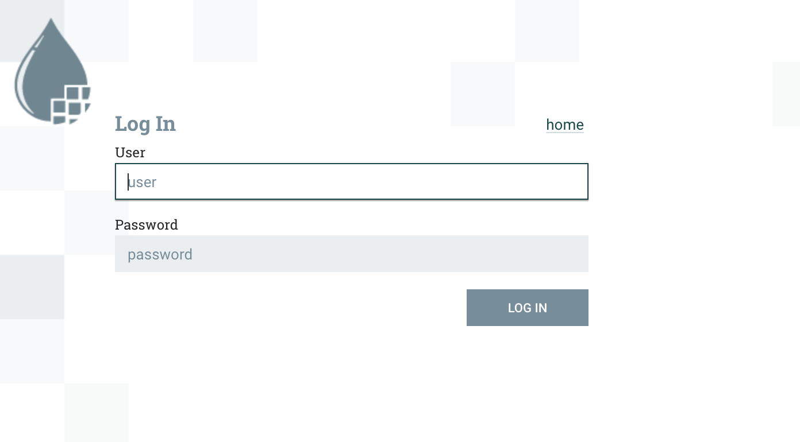
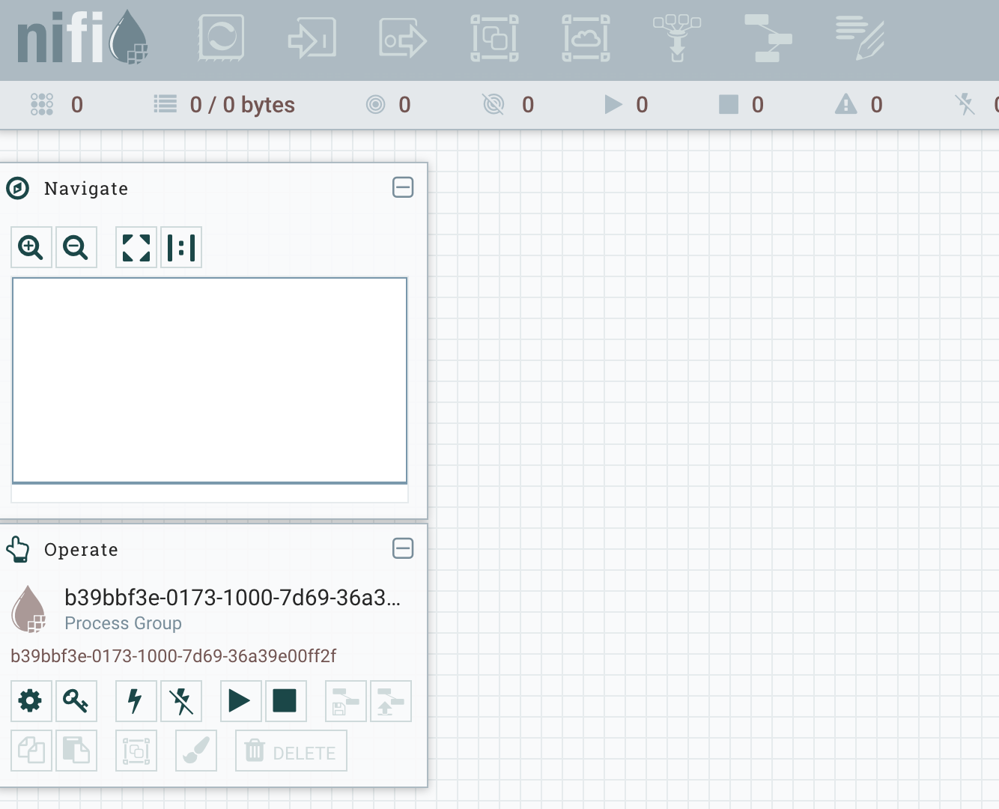
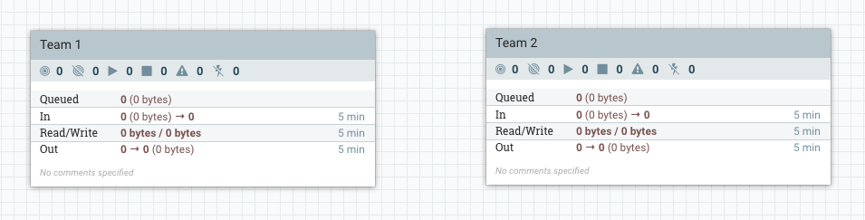
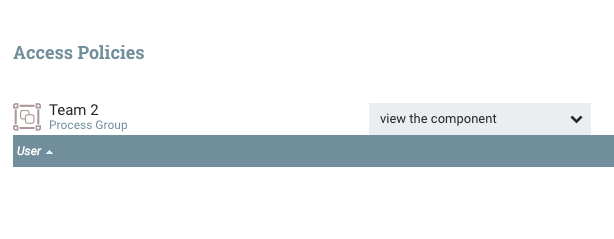
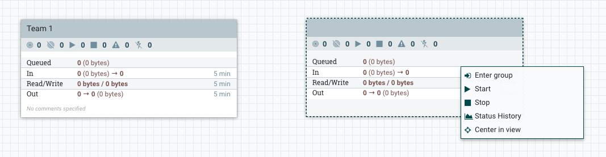

User Management
=============

* [1. Create the LDAP server](#1-create-the-ldap-server)
* [2. Configure the various services](#2-configure-the-various-services)
     * [Grafana](#grafana)
     * [JupyterHub](#jupyterhub)
     * [Superset](#superset)
     * [PostgreSQL](#postgresql)
     * [NiFi](#NiFi)
     	* [Configuration](#Configuration) 
     	* [sign in](#sign_in)
     	* [Authorizers & Initial Admin Identity](#Authorizers_&_Initial_Admin_Identity)
     	* [Adding users](#Adding_users)
     	* [Multi-Tenancy](#Multi-Tenancy)
* [3. Manage your LDAP server](#3-manage-your-ldap-server)
     * [Adding a user](#adding-a-user)
* [4. Creating groups](#4-Creating-groups)
     * [1. PostgresQL](#1-PostgresQL)
     * [2. Grafana](#2-Grafana)
     * [3. JupyterHub](#3-JupyterHub)

This page provides information on how to configure FADI user authentication and authorization (LDAP, RBAC, ...).

For user management, FADI uses [OpenLDAP](https://www.openldap.org) to ensure the [LDAP user authentication](https://en.wikipedia.org/wiki/Lightweight_Directory_Access_Protocol) for the platform services.

## 1. Create the LDAP server

<a href="https://www.openldap.org/" title="OpenLDAP"> </a>

> "OpenLDAP Software is an open source implementation of the Lightweight Directory Access Protocol."

The **OpenLDAP** service creates an empty LDAP server for the company `Example Inc.` and the domain `example.org` by default, which we will overwrite via the environment variables in the Helm chart.

The first entry that will be created is for the administrator user. To initially connect any of the services, you can use the following credentials:

* Username: `admin`
* Password: `password1`

Once created, we either add the users/groups manually through the phpLDAPadmin web interface, or pass a [LDIF file](https://en.wikipedia.org/wiki/LDAP_Data_Interchange_Format) (see the [sample ldif file](/examples/basic/example.ldif)) to the chart.

## 2. Configure the various services

### Grafana

Grafana has 3 roles by default: **Admin** , **Editor** and **Viewer**. To assign these roles to the different groups of LDAP users, you need to pass that in the configuration. Let's assume you have a group of developers in your LDAP server with the entry `cn=developers,ou=groups,dc=ldap,dc=cetic,dc=be` that you want to give the role of **Editor**. You can add these 3 lines of configuration under the default LDAP configuration that FADI already provides:

```
[[servers.group_mappings]]
group_dn = "cn=developers,ou=groups,dc=ldap,dc=cetic,dc=be"
org_role = "Editor"
```

For more information, see [Grafana LDAP documentation](https://grafana.com/docs/auth/ldap/#configuration-examples).

### JupyterHub

JupyterHub configuration allows you to give access to users/groups through templates, the templates usually follow this syntax:

* `uid={username},cn=admin,dc=ldap,dc=cetic,dc=be`
* `uid={username},ou=developers,dc=ldap,dc=cetic,dc=be`

where `{username}` will be overwritten by the value the user passes as username in the authentication screen. Let's suppose we only have those two templates, when the user David passes his name for authentication. For him to successfully sign in, his entry should be one of the following:

* `uid=david,ou=admins,dc=ldap,dc=cetic,dc=be`
* `uid=david,ou=developers,dc=ldap,dc=cetic,dc=be`

which means if David is not in the `developers` or `admins` groups, he will not be able to sign in.

A sample configuration can be found in the `jupyterhub:auth` section of the default FADI [`values.yaml` file](https://github.com/cetic/helm-fadi/blob/master/values.yaml)

More details on using LDAP with JupyterHub in the [Jupyter documentation](https://z2jh.jupyter.org/en/stable/authentication.html#authenticating-with-ldap). 

### Superset

Superset uses **Flask-AppBuilder** Security for the LDAP authentication, in order to activate we need to pass the configuration inside python config `configFile.py`.

For more information on how to configure Superset with LDAP, follow the official documentation for the [flask-appbuilder authentication-ldap](https://flask-appbuilder.readthedocs.io/en/latest/security.html#authentication-ldap).

For more information about the different options you can use to configure your Superset LDAP authentication, follow the official documentation for the [Base Configuration](https://flask-appbuilder.readthedocs.io/en/latest/config.html).

### PostgreSQL

LDAP authentication method in PostgreSQL uses LDAP as the password verification method. LDAP is used only to validate the username/password pairs. Therefore there's a Cron job that executes the tool [pg-ldap-sync](https://github.com/larskanis/pg-ldap-sync) to synchronise the users between the LDAP server and the database.

Client authentication is controlled by a configuration file called `pg_hba.conf`, you can pass your authentication config through the variable `pghba` in the `values.yaml` file.

The configuration for the most common methods of authentication are:

```
local      database  user  auth-method  [auth-options]
host       database  user  address  auth-method  [auth-options]
```

For example, to use LDAP authentication for local users, your configuration should look like this:

```
local      all  all  ldap  ldapserver=example.com  ldapport=389 [other-ldap-options]
```

For more information about how to add LDAP authentication to PostgreSQL, follow [LDAP authentication in PostgreSQL](https://www.postgresql.org/docs/11/auth-ldap.html).

For more information about pg-ldap-sync: [Use LDAP permissions in PostgreSQL](https://github.com/larskanis/pg-ldap-sync)

### NiFi

#### Configuration

To secure NiFi with Ldap we need to enable SSL for NiFi. As part of enabling SSL, NiFi will also automatically enable authentication requiring an additional authentication method which in our case will be Ldap, to get detailed description of the whole process: [Apache NiFi - Authorization and Multi-Tenancy](https://bryanbende.com/development/2016/08/17/apache-nifi-1-0-0-authorization-and-multi-tenancy)

to Configure Ldap in this helm chart we need to first enable it by setting the variable `auth.ldap.enabled` to **true** then configure the rest of the variables. here's an example for tthe default fadi ldap:

```
  enabled: true
    host: ldap://fadi-openldap:389
    searchBase: cn=admin,dc=ldap,dc=cetic,dc=be
    admin: cn=admin,dc=ldap,dc=cetic,dc=be
    searchFilter: (objectClass=*)
    UserIdentityAttribute: cn
    pass: password1

```
 
 when ldap is enabled make sure to change the variables `properties.isSecure` and `properties.clusterSecure` to **true** and set `properties.httpPort` to **null** and `properties.httpsPort` to **9443**, Also it's mandatory to set the **namesapce** and the **release-name** you're going to use in advance respectivly in `properties.namespace` and `properties.release` .

#### Sign in 


When you access Nifi a sign-in screen will show up, you can sign in using your Ldap username/password normally ( not the full DN ).



**Important note:** only One user can connect the first time and it's the user with the **Initial Admin Identity**, in FADI it's the default LDAP admin user ( admin / password1 ). once connected you'll get access the the UI that will look like this :



you will notice that everything is desabled and that's because there are no users registred and no policies ( persmissions ) destributed, but the Initial Admin has all the rights to create policies and give permissions.

#### Authorizers & Initial Admin Identity

We can see that the initial admin has READ/WRITE access to /flow, /tenants, /policies, and /controller, and the cluster nodes have READ/WRITE access to /proxy. This allows the initial admin to get into the UI (/flow) and to create new users/groups (/tenants), and to create new policies (/policies), but you’ll notice there are no policies granting access to the root process group, or any other components. This is why all of the actions in the toolbar are grayed-out. 

We can create a policy for the root process group by clicking the key icon in the operate palette on the left. We should see the do the following:


After creating the necessary policies, the “view component” action on the root process group, which is essentially the READ action and the “modify the component” which is the WRITE policy for the root process group the admin user will have the appropriate authorizations. 

PS: you can do the same thing for the rest of policies.

#### Adding users

Adding the ldap users has to be done manually through the UI as **there is no syncing mechanism to automatically add LDAP users/groups into NiFi** .

When connected with your initial admin account (using your individual certificate), go into users to add your users, and then into policies to grant access and rights to the users, in this example we're going to add the user John who already exists in the ldap server ( to add the user we should use the full DN: `cn=john,cn=admin,dc=ldap,dc=cetic,dc=be` )

 

After adding the user **don't forget to assign the policies** for that user to give the needed permissions by default the new user cannot even access the UI.

#### Multi-Tenancy

This is copied from this great article: [Apacche Nifi - Authorization and Multi-Tenancy](https://bryanbende.com/development/2016/08/17/apache-nifi-1-0-0-authorization-and-multi-tenancy).

 The policy structure is hierarchical, such that when access is checked for a component, if no policy is found then it checks the parent, and if not policy is found for the parent, it checks the parent’s parent, and so on, until reaching the root process group. This means that by giving ourselves READ/WRITE to the root group we now have READ/WRITE for all sub-components **until a more restrictive policy is created.**

Lets simulate how two development teams might share a single NiFi instance by creating two process groups:


 

Lets pretend we are a member of Team 1 so we should have full access to the first process group, but we shouldn’t be able to know anything about what Team 2 is doing, and shouldn’t be able to modify their flow. We can simulate this by creating a more restrictive policy on the “Team 2” process group that does not include the current user (the initial admin).

If you select the “Team 2” process group, you’ll notice the palette on the left changes and says “Team 2”. This palette always operate in the context of the selected component, so if we click the key icon while “Team 2” is selected, we are now editing the policies for the “Team 2” process group. If we click the “Override this policy” link for “view component” and create a new policy without adding users, we should get the following:

 

If we do the same thing for “modify the component” and then return to the main canvas we should see the following on the next refresh:

 


We can no longer see the name of the group, and we now have a more restrictive context menu that prevents us from configuring the group. 

#### enabling ladp in values.yaml

For NIFI we need a particular configuration in the `values.yaml` file, first the variable `nifi.auth.ldap.enabled` must be set to true to enable ldap and then configure the different ldap variables, it should look something like this:


```yaml
auth:
    ldap:
      enabled: true
      host: ldap://fadi-openldap:389
      searchBase: cn=admin,dc=ldap,dc=cetic,dc=be
      admin: cn=admin,dc=ldap,dc=cetic,dc=be
      pass: password1
      searchFilter: (objectClass=*)
      userIdentityAttribute: cn
```

Then we make sure to pre-set the nodePort, let's say we want your node port to be 34567, our service configuration should look like this :

```yaml
service:
  type: NodePort
  nodePort: 34567
```

And then we set the properties as follows, the `nifi.properties.webProxyHost` variable should has the exact url with the exact port that we're going to use to access NIFI later, if our dns is nifi.example.cetic.be and/or the ip address 10.10.10.10, our configuration should look like this:


```yaml
  properties:
    externalSecure: false
    isNode: false
    httpPort: null
    httpsPort: 9443
    webProxyHost: nifi.example.cetic.be:34567, 10.10.10.10:34567
    clusterPort: 6007
    clusterSecure: true
```


## 3. Manage your LDAP server

<a href="http://phpldapadmin.sourceforge.net/wiki/index.php/Main_Page" alt="phpLDAPadmin"></a>

> " phpLDAPadmin is a web app for administering Lightweight Directory Access Protocol (LDAP) servers.."

In order to use [phpLDAPadmin](http://phpldapadmin.sourceforge.net/wiki/index.php/Main_Page) you have to pass the configuration for your LDAP server through the environmental variable `_PHPLDAPADMIN_LDAP_HOSTS_`. To connect this service with the OpenLDAP server, you need to pass **the name of the service** (`fadi-openldap`). To connect to the web application, run the following command:

```bash
minikube service fadi-phpldapadmin -n fadi
```

The main page for phpLDAPadmin will open in your default browser where you can connect to your LDAP server and manage it.


The first entry that will be created is for the administrator and the password is initialized to `password1` which makes the credentials to use to connect to this server in phpLDAPadmin the following:

* Login DN: `cn=admin,dc=ldap,dc=cetic,dc=be`
* Password: `password1`

For more information on how to use phpLDAPadmin, see the [phpLDAPadmin documentation](http://phpldapadmin.sourceforge.net/function-ref/1.2/).

### Adding a user

This section provides an example on how to add a user through phpLDAPadmin and access the Superset, Grafana and JupyterHub services.

#### 1. Connect to phpLDAPadmin

<a href="http://phpldapadmin.sourceforge.net/wiki/index.php/Main_Page" alt="phpLDAPadmin"></a>

Access your phpLDAPadmin service and connect using the admin Login DN and password, defaults are:

* Login DN: `cn=admin,dc=ldap,dc=cetic,dc=be`
* Password: `password1`


### 2. Add users

To add users, there are two ways: using a template and manually.

#### Import the user using a template

The template below adds a user called John Doe:

```
dn: cn=John,cn=admin,dc=ldap,dc=cetic,dc=be
cn: John
givenname: John
mail: john@mail.com
objectclass: inetOrgPerson
objectclass: top
sn: Doe
uid: John Doe
userpassword: Johnpassword
```

Change the user name and other misc info (mail, etc.) and copy/paste it in the import field, here is an example of a modified template for a user called `Luke Skywalker`:

```
dn: cn=Luke,cn=admin,dc=ldap,dc=cetic,dc=be
cn: Luke
givenname: Luke
mail: luke.skywalker@mail.com
objectclass: inetOrgPerson
objectclass: top
sn: Skywalker
uid: Luke Skywalker
userpassword: ThereIsNoTry
```

Now you can go to `import`, paste that template and click `proceed` and the user will be added.


#### Add the user manually

You can add a user manually through phpLDAPadmin, after connecting go to `Create new entry here`:


You can for example create a user in the default admin group `cn=admin,dc=ldap,dc=cetic,dc=be`, or create a new group in which you can create new users. 

In this example, we are going to create a simple user under the default admin user (which is also a group).

When you click on  `⭐️Create new entry here`, a new window called `Select a template for the creation process` will show up with all the different entries you can create:


Go to `Generic: User Account` and a list of fields will show up. Enter the information about the user you want to create and click `Create Object`.
 
## 4. Creating groups 

The LDAP protocol does not define how programs function either on the server or client, but the messages exchanged between an LDAP server and an LDAP client. 
To manage your users you need to know how to create users/groups in the LDAP server and then you need to assign every user/group to the right service or application **through the application's configuration in the `values.yaml` file**.

We are going to create a group called **devs** and a group called **admins** and add a user in each group and then **configure each service** to authenticate the newly created users/groups.

### Create groups in openLDAP

Here is a simple ldif code to import that will create:

* An Organizational Unit `OU=people`
* A group called **admins** under `ou=people,dc=ldap,dc=cetic,dc=be` so the dn will be `cn=admins,ou=people,dc=ldap,dc=cetic,dc=be`
* A user called `John` under `cn=admin,dc=ldap,dc=cetic,dc=be` so the dn will be `cn=john,cn=admins,ou=people,dc=ldap,dc=cetic,dc=be` with the password `john123`
* A group called **devs** under `ou=people,dc=ldap,dc=cetic,dc=be` so the dn will be `cn=devs,ou=people,dc=ldap,dc=cetic,dc=be` 
* A user called `Luke` under `cn=devs,dc=ldap,dc=cetic,dc=be` so the dn will be `cn=luke,cn=devs,ou=people,dc=ldap,dc=cetic,dc=be` with the password `luke123`

```
dn: ou=people,dc=ldap,dc=cetic,dc=be
ou: people
objectClass: organizationalUnit

dn: cn=admins,ou=people,dc=ldap,dc=cetic,dc=be
cn: admins
gidnumber: 501
objectclass: posixGroup
objectclass: top

dn: cn=devs,ou=people,dc=ldap,dc=cetic,dc=be
cn: devs
gidnumber: 500
objectclass: posixGroup
objectclass: top

dn: cn=luke,cn=devs,ou=people,dc=ldap,dc=cetic,dc=be
cn: luke
gidnumber: 500
givenname: luke
homedirectory: /home/users/lskywalker
loginshell: /bin/sh
objectclass: inetOrgPerson
objectclass: posixAccount
objectclass: top
sn: skywalker
uid: luke
uidnumber: 1000
userpassword: {MD5}hSQr2UGesHOpB9f3VrX43Q==

dn: cn=john,cn=admins,ou=people,dc=ldap,dc=cetic,dc=be
cn: john
gidnumber: 501
givenname: john
homedirectory: /home/users/John
loginshell: /bin/sh
objectclass: inetOrgPerson
objectclass: posixAccount
objectclass: top
sn: Doe
uid: john
uidnumber: 1001
userpassword: john123
```

### 1. PostgreSQL

To copy the groups/users in postgreSQL we need to configure the Cron job that executes the tool [pg-ldap-sync](https://github.com/larskanis/pg-ldap-sync) to synchronise the users between the LDAP server and the database, therefore we are configuring pg-ldap-sync to add the users of our group.

In the `values.yaml` file, head to the variable `postgresql.ldap.pgldapconfig` and make sure the `ldap_users` section looks like this:

```
ldap_users:
base: DC=ldap,DC=cetic,DC=be
# LDAP filter (according to RFC 2254)
# defines to users in LDAP to be synchronized
filter: (!(cn=admin))
# this attribute is used as PG role name
name_attribute: uid
# lowercase name for use as PG role name
lowercase_name: true
```

And the `ldap_groups` section looks like this:


```
ldap_groups:
base: DC=ldap,DC=cetic,DC=be
filter: (|(cn=devs)(ou=people)(cn=admins))
# this attribute is used as PG role name
name_attribute: cn
# this attribute must reference to all member DN's of the given group
member_attribute: member
```
The main change here is the **filter `filter: (|(cn=devs)(ou=people)(cn=admins))`** in which we add the names of the groups we want to be added to PostgreSQL, for example if our filter is `filter: (|(cn=devs)(ou=people))` the group **admins** will not be added.

### 2. Grafana

For Grafana, head to the variable `grafana.ldap.config` and make sure it looks like this:

```
    config: |-
      verbose_logging = true
      [[servers]]
      host = "fadi-openldap"
      port = 389
      use_ssl = false
      start_tls = false
      ssl_skip_verify = false
      bind_dn = "cn=admin,DC=ldap,DC=cetic,DC=be"
      bind_password = 'password1'
      search_filter = "(|(cn=%s)(uid=%s))"
      search_base_dns = ["dc=ldap,dc=cetic,dc=be"]
      group_search_base_dns = ["ou=people,dc=ldap,dc=cetic,dc=be"]

      [servers.attributes]
      name = "givenName"
      surname = "sn"
      username = "cn"
      member_of = "memberOf"
      email =  "email"

      [[servers.group_mappings]]
      group_dn = "cn=admins,ou=people,dc=ldap,dc=cetic,dc=be"
      org_role = "Admin"
      grafana_admin = true

      [[servers.group_mappings]]
      group_dn = "*"
      org_role = "Viewer"
```

The main change here is `group_search_base_dns = ["ou=people,dc=ldap,dc=cetic,dc=be"]` in which we add Organizational Unit `OU=people` so it can find the newly created groups **devs** and **admins**. Then, to manage the access ( and/or roles ) you can follow the [documentation](https://grafana.com/docs/grafana/latest/auth/ldap/), adding the following sample of configuration will give the **group admins** the **admin rights** and all the rest the **Viewer rights**.


```
      [[servers.group_mappings]]
      group_dn = "cn=admins,ou=people,dc=ldap,dc=cetic,dc=be"
      org_role = "Admin"
      grafana_admin = true

      [[servers.group_mappings]]
      group_dn = "*"
      org_role = "Viewer"
```

The **admin rights** make the user a Super Admin. This means they can access the Server Admin views where all users and organizations can be administrated in addition of course to creating/editing dashboards, data sources etc, and the **Viewer rights** allow the users to only **see** the created dashboards.
 
For more information, see the [Grafana permissions overview](https://grafana.com/docs/grafana/latest/permissions/overview/).

### 3. JupyterHub

For JupyterHub, the variable `jupyterhub.auth.ldap.dn.templates` is a list of DNs to be accepted. 

If we want to add the **group devs** and give them access, we add this line `cn={username},cn=devs,dc=ldap,dc=cetic,dc=be` where `{username}` is the username corresponding to the user. 

Here we are not adding `cn={username},cn=admins,dc=ldap,dc=cetic,dc=be` so the group **admins** will not have access, the list should look like this:

```yaml
   auth:
    type: ldap
    ldap:
      server:
        address: fadi-openldap
      dn:
        templates:
          - 'cn={username},cn=admin,dc=ldap,dc=cetic,dc=be'
          - 'uid={username},cn=admins,ou=people,dc=ldap,dc=cetic,dc=be'
          - 'cn={username},dc=ldap,dc=cetic,dc=be'
          - 'cn={username},cn=devs,ou=people,dc=ldap,dc=cetic,dc=be'
```


