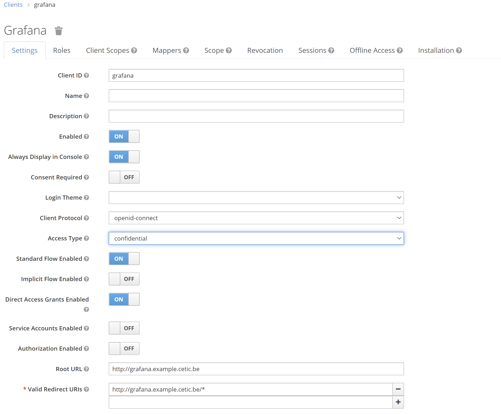

KeyCloak
=============

* [1. Configure keycloak](#1-configure-keycloak)
     * [Create realm](#Create-realm)
     * [Create client](#Create-client)
     * [Create users](#Create-users)
     * [Role mapping](#Role-mapping)

* [2. Integrate Keycloak](#2-Integrate-Keycloak)
     * [Integrate with Grafana](#Integrate-with-Grafana)


## 1. Configure keycloak

<a href="https://www.openldap.org/" alt="OpenLDAP"> </a>

> "Keycloak is an open source Identity and Access Management solution aimed at modern applications and services. It makes it easy to secure applications and services with little to no code."

Keycloak is first deployed with one admin user that we need to configure before deployment, to do so we need to pass the username/password in the values file like follows:

```
  auth:
    createAdminUser: true
    adminUser: admin
    adminPassword: "password1"
```

Once deployed we can access the ui and log in, when trying to access keycloak will get the following screen 


We click on **administration console** then we log in using the credentials we configured above:

* Username: `admin`
* Password: `password1`

once logged in we get the following UI:


##Create realm

When you log in to the admin console, you work in a realm, which is a space where you manage objects. Two types of realms exist:

* **Master realm** - This realm was created for you when you first started Keycloak. It contains the admin account you created at the first login. You use this realm only to create other realms.

* **Other realms** - These realms are created by the admin in the master realm. In these realms, administrators create users and applications. The applications are owned by the users.


To create a realm head to the Master menu, click Add Realm. When you are logged in to the master realm, this menu lists all other realms, then we type **devops** in the Name field to name our new real devops.


when we click **Create** the main admin console page opens with realm set to Devops, now we can switch between managing the master realm and the realm we just created by clicking entries in the Select realm drop-down list.


##Create client

To create clients we first click **Clients** in the **left side menu** to open the Clients page.


On the right side, we click **Create** and then on the Add Client dialog, we create a client called Grafana by completing the fields as follows:

* Client ID: Grafana
* Root URL: \<your-grafana-address>, for this example our grafana adress is http://10.10.10.10:30300


Once the client is created,we open the client configuration and change the **access type** to **confidential** from public and complete the rest of the fields as shown below assuming our grafana adress is http://10.10.10.10:30300, then we **Save the config**.





Now we open the client grafana again and go to **credentials tag** and copy the client id and secret because we're going to need them to configure grafana later.


##Create user

In the devops realm, we need to create a new user and a temporary password for that new user, we head to the left menu, click Users to open the user list page.


On the right side of the empty user list, click Add User to open the Add user page.


we enter a name in the Username field (this is the only required field), then we flip the Email Verified switch to On and click Save.


The management page for the new user opens, we Click the **Credentials tab** to set a temporary password for the new user, we type a new password and confirm it.


the we Click **Set Password** to set the user password to the new one we specified.

##Role mapping

After creating the user we need to map this user to the grafana client we created earlier.

first we head to the clients page and choose grafana, then  we Click the **Roles tab** and then click add Role:


we fill in the role name and description then click save.


now that we have at least one role for grafana we map this new role to the user we created earlier so we can log in using the new user.

now we head back to the Clients page and chose john, then we click the **Role mappings** tab, in **client role** dropdown menu we choose grafana.


then we can find the role admin that we created, we **select admin** and then click **add selected**.

## 2. Integrate Keycloak

### Integrate with Grafana

After creating the client in keycloak we have to configure Grafana to use Oauth and connect it to keyclaok, we do so in grafana's **grafana.ini** file that we can configure in the **helm chart's configmap** [keycloak.yaml](https://github.com/cetic/helm-fadi/blob/feature/keycloak/templates/keycloak.yaml).

Now to configure grafana we edit as below where devops is the realm name, client id is the client name and client secret the **previously copied code**, in this example **Keyclaok's NodePort** is **30330** which makes **keycloak's address** **http://10.10.10.10:30330** ( we can find the Generic OAuth at **line 469** in [keycloak.yaml](https://github.com/cetic/helm-fadi/blob/feature/keycloak/templates/keycloak.yaml).. 

```
    #################################### Generic OAuth #######################
    [auth.generic_oauth]
    name = OAuth
    enabled = true
    allow_sign_up = true
    client_id = Grafana
    client_secret = ad35e16d-96d1-46ab-88d8-7cdb1512b608
    scopes = openid profile email
    email_attribute_name = email:primary
    email_attribute_path =
    login_attribute_path =
    name_attribute_path =
    role_attribute_path =
    id_token_attribute_name =
    auth_url = http://10.10.10.10:30330/auth/realms/devops/protocol/openid-connect/auth
    token_url = http://10.10.10.10:30330/auth/realms/devops/protocol/openid-connect/token
    api_url = http://10.10.10.10:30330/auth/realms/devops/protocol/openid-connect/userinfo
    allowed_domains =
    team_ids =
    allowed_organizations =
    tls_skip_verify_insecure = false
    tls_client_cert =
    tls_client_key =
    tls_client_ca =
```

Then back to the **server** configuration ( **line 35** ), we configure as shown below where 10.10.10.10 is the minikube IP ( or kubernetes IP ) and **http://10.10.10.10:30300** is the **grafana address**.

```
 #################################### Server ##############################
    [server]
    # Protocol (http, https, h2, socket)
    protocol = http

    # The ip address to bind to, empty will bind to all interfaces
    http_addr =

    # The http port to use
    http_port = 3000

    # The public facing domain name used to access grafana from a browser
    domain = 10.10.10.10

    # Redirect to correct domain if host header does not match domain
    # Prevents DNS rebinding attacks
    enforce_domain = false

    # The full public facing url
    # root_url = %(protocol)s://%(domain)s:%(http_port)s/
    root_url = http://10.10.10.10:30300

```

> PS: this is a temporary and not the final format of the document as it will be completed as we progress with adding keycloak to fadi.

Now after configuring grafana we need to apply these modifications, to do so we can use the command:

```
helm upgrade --install fadi
```

Once fadi upgrades grafana will reboot with our new configuration, now we can head to our grafana and we should notice that we have the option **Sign in with OAuth** which the option we're going to choose.


that will take us to a keycloak themed authentification screen, that's where we can authenticate using the **user** that we created earlier in keycloak and mapped to the Grafana client.


here we can authenticate using the user john and the temporary password we set up earlier, before logging in to grafana we will be asked to **update the password** like shown below:


We set a new password for ou user and then click **submit**, after we submit we will receive a grafana server error that's fine all we have to do is to try to log in to grafana again and this time we will be logged in automatically.


This document is inspired by keycloak's [getting started](https://www.keycloak.org/docs/latest/getting_started/) and this [tutorial](https://www.techrunnr.com/how-to-setup-oauth-for-grafana-using-keycloak/).
