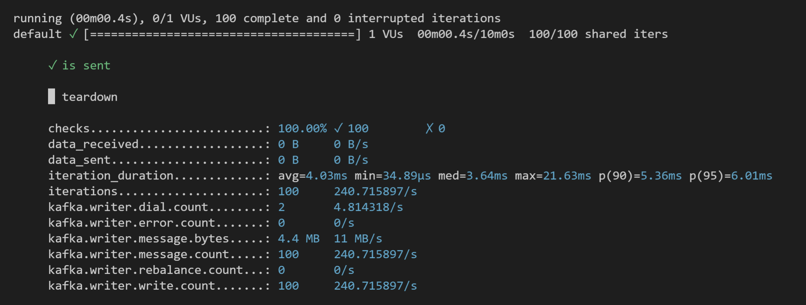
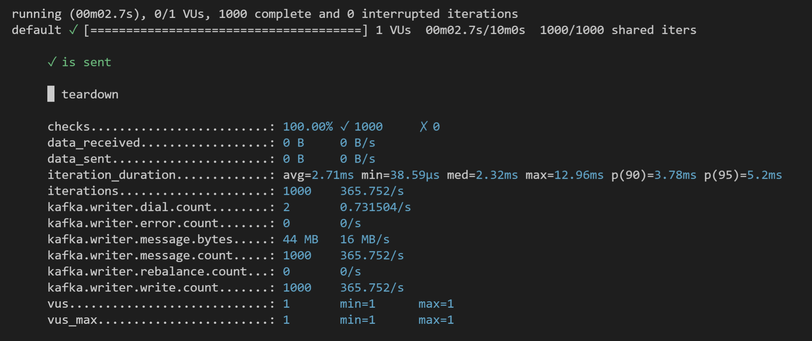
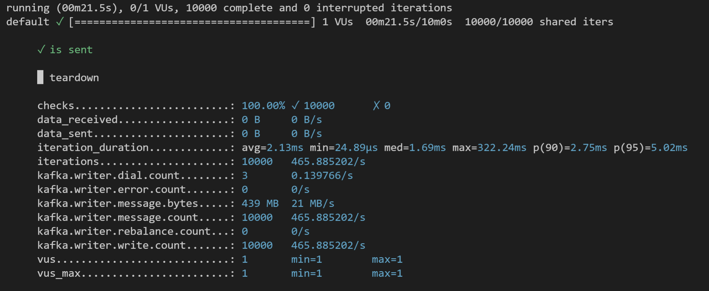
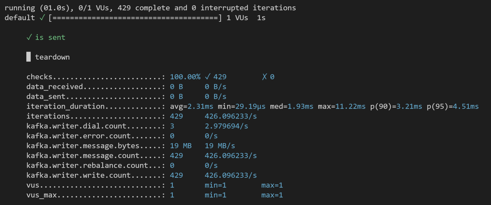
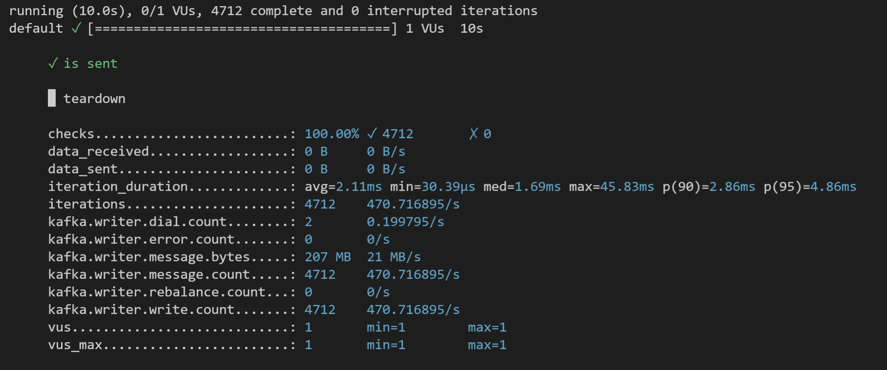
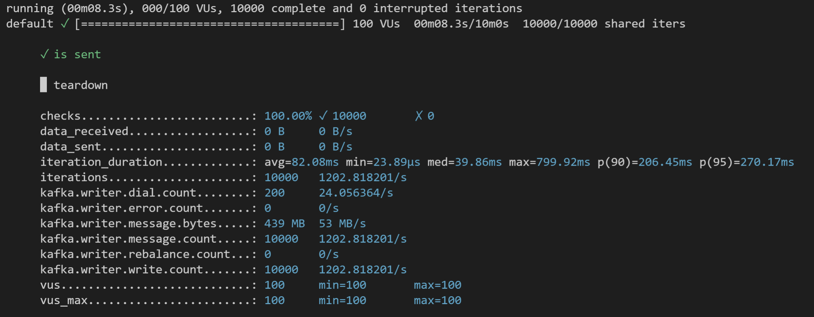

Load testing Kafka with k6
========

This use case will show how to use k6 installed on Ubuntu for a load test on Kafka. k6 will be used to send a pre-defined number of events to a pre-defined topic.

## Kafka deployment

First, install and get the IP address of the Kafka service.

For the installation, we will use the FADI Helm chart with the values.yaml file in this folder : 

```bash
helm repo add cetic https://cetic.github.io/helm-charts/
helm repo update
helm install cetic/fadi -f values.yaml 
```

To get the IP address of the Kafka service, type this command :

```
kubectl get service 
```

## k6 deployment

To deploy k6, we will use an Ubuntu container. Next, we will install GO and k6 there. To be able to do a load test on Kafka, k6 needs a plugin that we are going to add.

### a. Deploy Ubuntu

You can use the "deployment.yaml" file in this folder to deploy the Ubuntu pod :

```
kubectl apply -f deployment.yaml
```

Then, enter into the pod by typing this command :

```
kubectl exec -it <your_ubuntu_pod> /bin/bash
```

Once into the pod, we can install the tools.

### b. Install GO

You will find [here](https://go.dev/doc/install) that shows how to install GO on Ubuntu.

### c. Install k6 and Kafka plugin

To install k6 and the Kafka plugin, enter these commands :

```
go install go.k6.io/xk6/cmd/xk6@latest
xk6 build --with github.com/mostafa/xk6-kafka@latest
```

Now, you have k6 and Kafka plugins installed. 

## Load test

Once all the requirements installed, we can run to a load test.

First, copy the content of the ["script.js"](./script.js) file. Create a "*kafka-test.js" file in the directory where k6 is installed in the Ubuntu pod and paste the content.

Replace the `bootstrapServers` IP address with the Kafka service IP address.

This script will :

* Create in Kafka a topic named 'xk6_kafka_json_topic'
* Send a number of copies that we will define of 2 events ('Load Testing SQL Databases with k6' and 'Benchmarking Redis with k6')
* Check if events are successfully sent
* Teardown the data in Kafka

To start the load test, you can adapt this command :

```
./k6 run --vus 1 --duration 10s --iterations 10  script.js
```
That will send 10 copies of each event in a period of 10s.

You can now see the results of the load test directly on your CLI.

## Some results

### a. Per iteration
100 iterations
<a> </a>

1000 iterations
<a> </a>

10000 iterations
<a> </a>

### b. Per time

1 second
<a> </a>

10 seconds
<a> </a>

### c. Per virtual user (10000)

50 VUs
<a> </a>

100 VUs
<a> </a>
