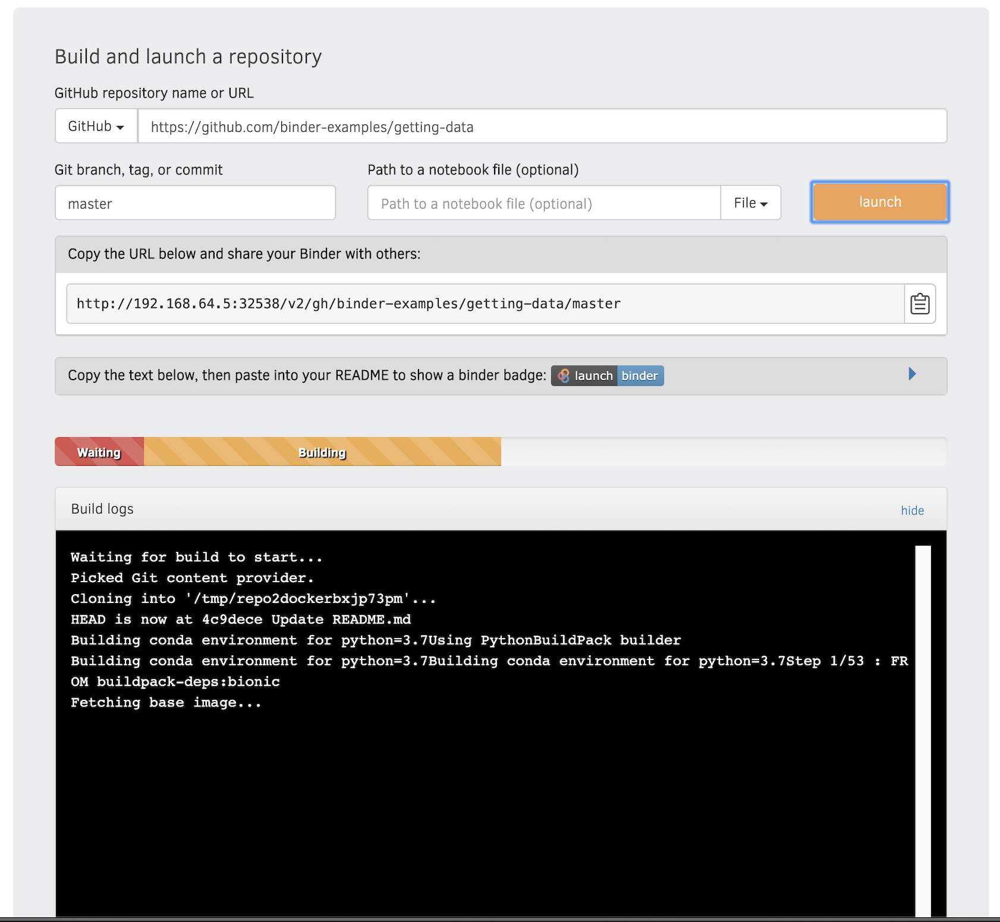
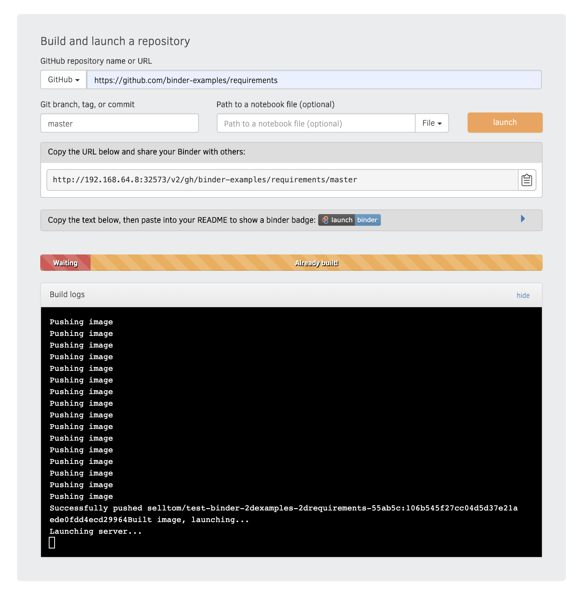
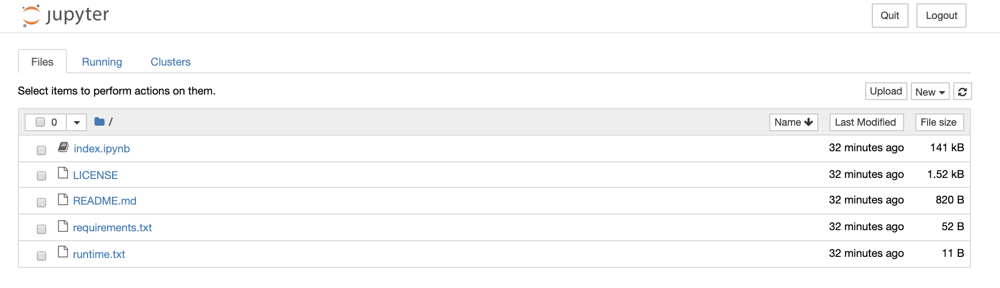
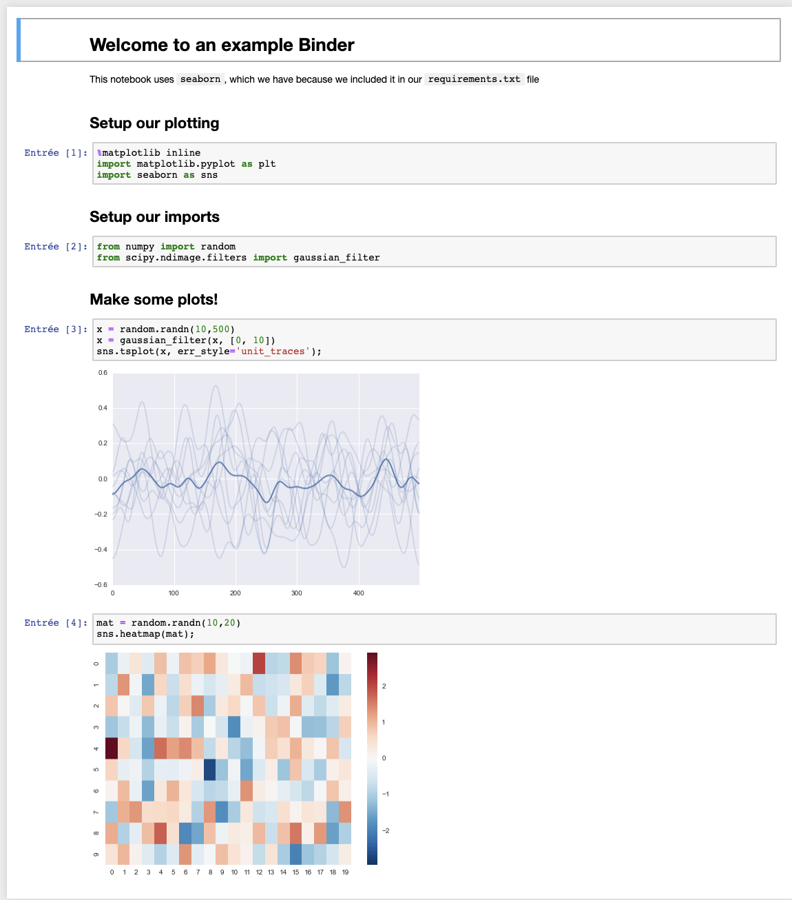

<a href="https://binderhub.readthedocs.io/en/latest/" alt="BinderHub"></a>
# What's Binderhub

*The primary goal of BinderHub is creating custom computing environments that can be used by many remote users. BinderHub enables an end user to easily specify a desired computing environment from a Git repo. BinderHub then serves the custom computing environment at a URL which users can access remotely.*

*BinderHub will build Docker images out of Git repositories, and then push them to a Docker registry so that JupyterHub can launch user servers based on these images*

# Add Binderhub around FADI

We assume that you have already a cluster deployed. If not, you can refer and follow our [Installation guide]() until the point 1.2.2

you will also need to have a valid Docker account.


Follow this step to have FADI with Binderhub installed into your cluster:
1. Clone this repository and go to the binderhub example folder:
```bash
git clone https://github.com/cetic/fadi.git fadi
cd $pwd/fadi/examples/binderhub
```

2. open the **config.yaml** file to set your docker credentials and the the name of your project to the following inputs:
```yaml
config:
    BinderHub:
      use_registry: true
      image_prefix: <DOCKER_ID>/<PROJECT_NAME>-
registry:
    username: <DOCKER_ID>
    password: >DOCKER_PASSWORD>
```

3. Launch the Helm script, this will deploy all the FADI services and Binderhub on the cluster (and may take some time).
```bash
./deploy.sh
# see deploy.log for connection information to the various services
```

# Basic example of binderhub workflow

## Input

## Building

## Pushing

## Server

## Launch

# References
 - [https://binderhub.readthedocs.io/en/latest/](https://binderhub.readthedocs.io/en/latest/)
