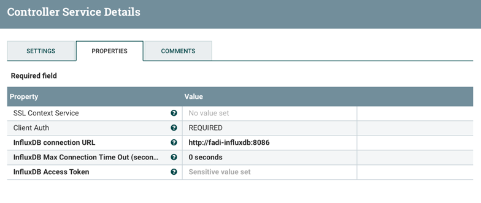
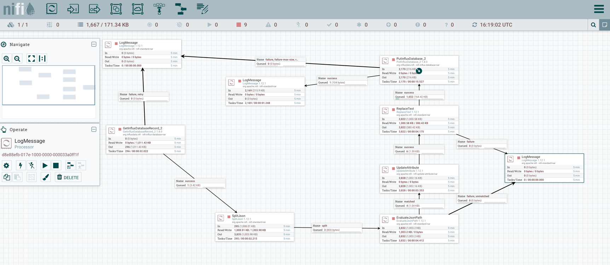

Use Case - using InfluxDB processor in Nifi
=========

This page provides documentation on how to connect InfluxDB (version 2.X) 
with Nifi. 

* [1. Problematic](#Problematic)
* [2. Installing Fadi](#Installing Fadi)
* [3. Running the use-case](#Running the use-case)

In this example, Nifi will query InfluxDB data from a bucket A, processes it and insert it on a bucket B.

Problematic
--

This section explains why adaptations is needed to make run InfluxDB (version 2.X) with Nifi.

### Problem with existing InfluxDB connectors

Nifi already embeds processors to query and insert data (e.g. 'ExecuteInfluxDBQuery').
Currently, those processors run with a version 1.X of InfluxDB   
Using those embedded connectors will raise authentification error if they are used with InfluxDB version 2.X.

```
influxdb.error.message
{"code":"unauthorized","message":"Unauthorized"}
```

### Looking for solutions

It exists other connectors to communicate to InfuxDB version 2.X but, at this time,
they are not built with nifi ([see bundle Nifi](https://github.com/influxdata/nifi-influxdb-bundle#about-this-project)).
This error is also defined on [stackoverflow](https://stackoverflow.com/questions/70706387/send-data-from-sql-server-to-influxdb-via-apache-nifis-putinfluxdb-processor)

It also seems that changing the version of [Nifi](https://nifi.apache.org/docs/nifi-docs/html/getting-started.html#downloading-and-installing-nifi) (1.12.1 and 1.15.2 tested) doesn't have impact on the InfluxDB connectors.
Only the version 1.X of influxDB is taken into account.

The only solution found is adding the new processor [updating the Nifi chart](https://github.com/cetic/helm-nifi#use-custom-processors).
After Nifi reloading, the new libraries are activated.

Installing Fadi
--
To run the example at least Nifi, Traefik and InfluxDB must be installed.

### Preparing the installation

Before installing Fadi, the Fadi chart must be customized with the extra libraries of Nifi. 
If you don't use Nifi v1.12.1 (Fadi currently uses this version), 
[download](https://github.com/influxdata/nifi-influxdb-bundle#installation) and update the library that fits your needs 
in the `nifi-influx-nar` folder.

The file `value.yaml` will install Fadi with Nifi, Traefik and InfluxDB. It will also 
customize the Nifi chart with the downloaded libraries.

### Running the installer

1. in `values.yaml`file, 
   1. update the Nifi field `path: "/Users/<YOUR_PATH>/nifi-influx-nar"`
   2. update the InfluxDB password 
   ```
      password: "<YOUR_PASSWORD>"
      token: "<YOUR_PASSWORD>"
   ```
2. run `./deploy.sh`

### Testing

The current Nifi version (v 1.12.1) cannot be reached by a port-forwarding.
Treafik must be used. To run Treafik, an ip must be provided.

if you are using minikube on a local cluster:
1. run `minikube tunnel` to associate an ip to your cluster (LB to Treafik)
2. configure your `/etc/hosts` file
```
<IP_TUNNEL> nifi.test.local
```
3. connect yourself to http://nifi.test.local/nifi/ to reach nifi
4. forward the port of influxDB 

Running the use-case
--

At this point your must be able to connect yourself to Nifi and InfluxDB.

### Importing data into InfluxDB

Data could be imported with a file or using a copy-paste function.

On the lateral bar choose `Data` and create a bucket. 
Once done, you could import data with the source tab (line protocol).
For the use-case we used `earthquake` data. The file is [here](./sample-data/influxDB-earthquake.csv).

Once data is imported you can run the following query:

```
from(bucket: "testfs")
  |> range(start: -30d, stop: -1h)
  |> filter(fn: (r) => r["_measurement"] == "earthquake")
  |> filter(fn: (r) => r["_field"] == "alert")
```

### Getting influx data with Nifi

Take care to always using a nifi plugin compatible with influxDB 2.

I get data from InfluxDB with the `GetInfluxDatabaseRecord_2` processor.
This processor use 2 controllers:
* a controller to manage the connection to the database (`standardInfluxDatabaseService_2`). 
  This controller setup the url connection and the InfluxDB AccessToken.
* a controller to get the resultset as JSON format.

The output of this processor is a JSON array containing the resultset.
e.g. 
```
[
{"result":"_result","table":0,"_start":1641743864851,"_stop":1644332264851,"_time":1643564786970,"_value":"green","_field":"alert","_measurement":"earthquake","code":"39928087","id":"ci39928087","magType":"mw","net":"ci","title":"M 4.1 - 5km WSW of Palomar Observatory, CA"},
{"result":"_result","table":1,"_start":1641743864851,"_stop":1644332264851,"_time":1643030183416,"_value":"orange","_field":"alert","_measurement":"earthquake","code":"7000gek3","id":"us7000gek3","magType":"mww","net":"us","title":"M 5.3 - 4 km S of Anse-à-Veau, Haiti"},
{"result":"_result","table":2,"_start":1641743864851,"_stop":1644332264851,"_time":1643033203532,"_value":"yellow","_field":"alert","_measurement":"earthquake","code":"7000gekf","id":"us7000gekf","magType":"mww","net":"us","title":"M 5.1 - 5 km E of Anse-à-Veau, Haiti"},
...]
```

### Writing data to influxDB 2

Data could be written to InfluxDB 2 with 2 kind of processors:
* `PutInfluxDatabaseRecord_2` which writes data based on Json data. Json data must follow a specific schema
* `PutInfluxDataDase_2` which writes data based on the [line protocol](https://docs.influxdata.com/influxdb/cloud/reference/syntax/line-protocol/) of influxDB.

For the POC I used the `PutInfluxDataDase_2`. 

### Running the scenerio

This [file](influx_dataflow.xml) describe a nifi scenario.



Here is the scenario:
1. Data are read from InfluxDB (processor `GetInfluxDatebaseRecord_2`) and the result is converted into Json array structure
2. The Json array is split
3. Each Json object is analysed (processor `EvaluateJsonPath`)
4. The new insert is created (processor `UpdateAttribute`)


