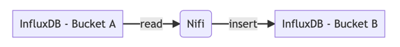
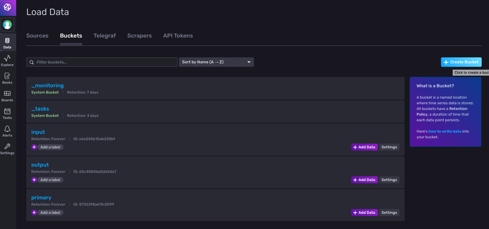
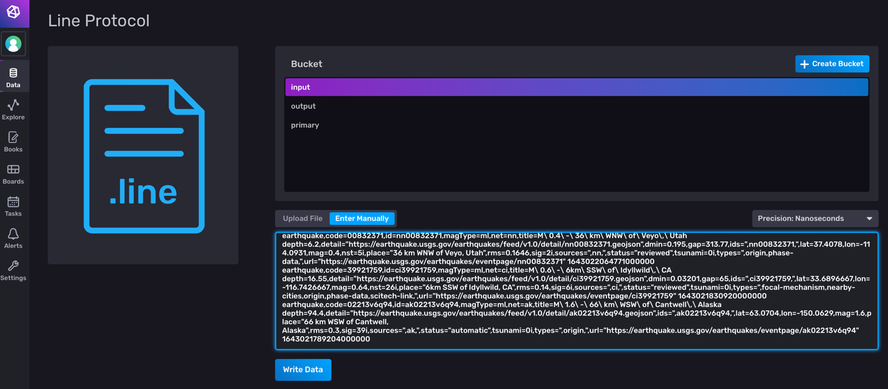
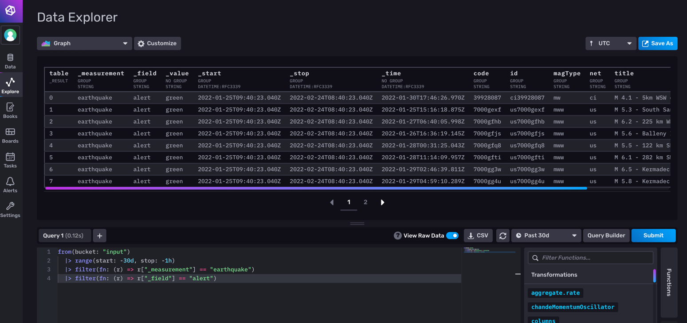
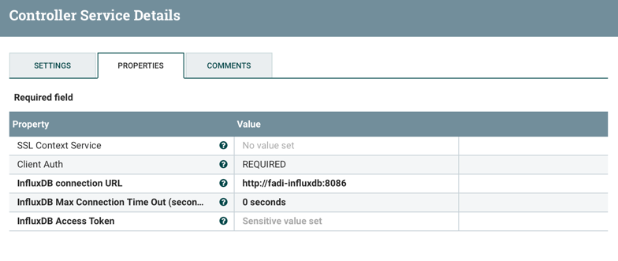

Use Case - using InfluxDB2 processors in NiFi
=========

This page provides documentation on how to connect InfluxDB (version 2.X) 
with NiFi. 

* [1. The problem](#The-problem)
* [2. Installing Fadi](#Installing-Fadi)
* [3. Running the use-case](#Running-the-use-case)

In this example, NiFi will query InfluxDB data from a bucket A, process it and insert it on a bucket B.


The problem
--

This section explains why adaptations are needed to make run InfluxDB (version 2.X) with NiFi.

### Problem with existing InfluxDB processors

[NiFi](https://nifi.apache.org) already embeds [processors](https://nifi.apache.org/docs.html) to query and insert data (e.g. 'ExecuteInfluxDBQuery').
Currently, those processors support version 1.X of [InfluxDB](https://www.influxdata.com)   
Using those embedded processors will raise authentification error if they are used with InfluxDB version 2.X:

```
influxdb.error.message
{"code":"unauthorized","message":"Unauthorized"}
```

### Looking for solutions

It exists other processors to communicate with InfuxDB version 2.X but, at this time,
they are not built with NiFi ([see bundle NiFi](https://github.com/influxdata/nifi-influxdb-bundle#about-this-project)).
This error is also defined on [stackoverflow](https://stackoverflow.com/questions/70706387/send-data-from-sql-server-to-influxdb-via-apache-nifis-putinfluxdb-processor)

It also seems that changing the version of [NiFi](https://nifi.apache.org/docs/nifi-docs/html/getting-started.html#downloading-and-installing-nifi) (1.12.1 and 1.15.2 tested) doesn't have impact on the InfluxDB processors.
Only the version 1.X of influxDB is taken into account.

The only solution found is adding the new processor by [updating the NiFi chart](https://github.com/cetic/helm-nifi#use-custom-processors).
After NiFi reloading, the new libraries are activated.

Installing Fadi
--
To run the example at least NiFi, Traefik and InfluxDB must be installed.

### Preparing the installation

Before installing Fadi, the Fadi chart must be customized with the extra libraries of NiFi. 
If you don't use NiFi v1.12.1 (Fadi currently uses this version), 
[download](https://github.com/influxdata/nifi-influxdb-bundle#installation) and update the library that fits your needs 
in the `nifi-influx-nar` folder.

This example's [value.yaml](values.yaml) file will install Fadi with NiFi, Traefik and InfluxDB. It will also 
customize the NiFi chart with the downloaded libraries.

### Running the installer

1. in [value.yaml](values.yaml) file, 
   1. update the NiFi field `path: "<PATH_ON_THE_HOST>/nifi-influx-nar"`
   2. update the InfluxDB password 
   ```
      password: "<YOUR_PASSWORD>"
      token: "<YOUR_PASSWORD>"
   ```
2. run `./deploy.sh` (localisated in [helm folder](../../helm/deploy.sh)) 

### Testing

The current NiFi version (v 1.12.1) cannot be reached by a port-forwarding.
Traefik must be used. To run Traefik, an IP address must be provided.

If you are using minikube on a local cluster:
1. run `minikube tunnel` to associate an IP address to your cluster (LB to Traefik)
2. configure your `/etc/hosts` file
```
<IP_TUNNEL> nifi.test.local
```
3. connect to [http://nifi.test.local/nifi/](http://nifi.test.local/nifi/) to reach nifi
4. forward the port of influxDB (e.g. using [Lens](https://k8slens.dev) or using a [kubectl command](https://kubernetes.io/docs/tasks/access-application-cluster/port-forward-access-application-cluster/#forward-a-local-port-to-a-port-on-the-pod)) 

NB: concerning the configuration of the security of InfluxDB, a good 
practice is to create one token by bucket ([more info here](https://docs.influxdata.com/influxdb/cloud/security/tokens/create-token/))

Running the use case
--

At this point you must be able to connect to NiFi and InfluxDB.

### Importing data into InfluxDB

Data can be imported with a file or using a copy-paste function.

On the lateral bar choose `Data` and create a bucket (`input`). 

Once done, you could import data with the source tab (line protocol).
For the use-case we used [earthquake data](https://docs.influxdata.com/influxdb/cloud/reference/sample-data/#usgs-earthquake-data). The file is [here](./sample-data/influxDB-earthquake.csv).


Once data is imported you can run the following query:

```
from(bucket: "input")
  |> range(start: -30d, stop: -1h)
  |> filter(fn: (r) => r["_measurement"] == "earthquake")
  |> filter(fn: (r) => r["_field"] == "alert")
```

You also need another bucket to put data. Create an empty bucket with this name (`output`) 

### Reading InfluxDB data with NiFi

Take care to always using a NiFi plugin compatible with influxDB 2.

You can read data from InfluxDB with the [GetInfluxDatabaseRecord_2](https://github.com/influxdata/nifi-influxdb-bundle#getinfluxdatabaserecord_2) processor.
This processor uses 2 controllers:
* a controller to manage the connection to the database (`standardInfluxDatabaseService_2`). 
  This controller configures the url connection and the InfluxDB AccessToken.
* a controller to get the resultset as JSON format.

The output of this processor is a JSON array containing the resultset.
e.g. 
```
[
{"result":"_result","table":0,"_start":1641743864851,"_stop":1644332264851,"_time":1643564786970,"_value":"green","_field":"alert","_measurement":"earthquake","code":"39928087","id":"ci39928087","magType":"mw","net":"ci","title":"M 4.1 - 5km WSW of Palomar Observatory, CA"},
{"result":"_result","table":1,"_start":1641743864851,"_stop":1644332264851,"_time":1643030183416,"_value":"orange","_field":"alert","_measurement":"earthquake","code":"7000gek3","id":"us7000gek3","magType":"mww","net":"us","title":"M 5.3 - 4 km S of Anse-à-Veau, Haiti"},
{"result":"_result","table":2,"_start":1641743864851,"_stop":1644332264851,"_time":1643033203532,"_value":"yellow","_field":"alert","_measurement":"earthquake","code":"7000gekf","id":"us7000gekf","magType":"mww","net":"us","title":"M 5.1 - 5 km E of Anse-à-Veau, Haiti"},
...]
```

### Writing data to InfluxDB 2

Data could be written to InfluxDB 2 with 2 kind of processors:
* [PutInfluxDatabaseRecord_2](https://github.com/influxdata/nifi-influxdb-bundle#putinfluxdatabaserecord_2) which writes data based on Json data. Json data must follow a specific schema
* [PutInfluxDataBase_2](https://github.com/influxdata/nifi-influxdb-bundle#putinfluxdatabase_2) which writes data based on the [line protocol](https://docs.influxdata.com/influxdb/cloud/reference/syntax/line-protocol/) of influxDB.

For this example we used the `PutInfluxDataDase_2`. 

### Running the scenario

The [XML dataflow file](influx_dataflow.xml) describes a NiFi scenario.


Here is the scenario:
1. Data is read from InfluxDB (processor `GetInfluxDatebaseRecord_2`) and the result is converted into Json array structure
2. The Json array is split to process each database record separately.
3. Each Json object is analysed (processor `EvaluateJsonPath`)
4. The new insert is created (processor `UpdateAttribute`)
