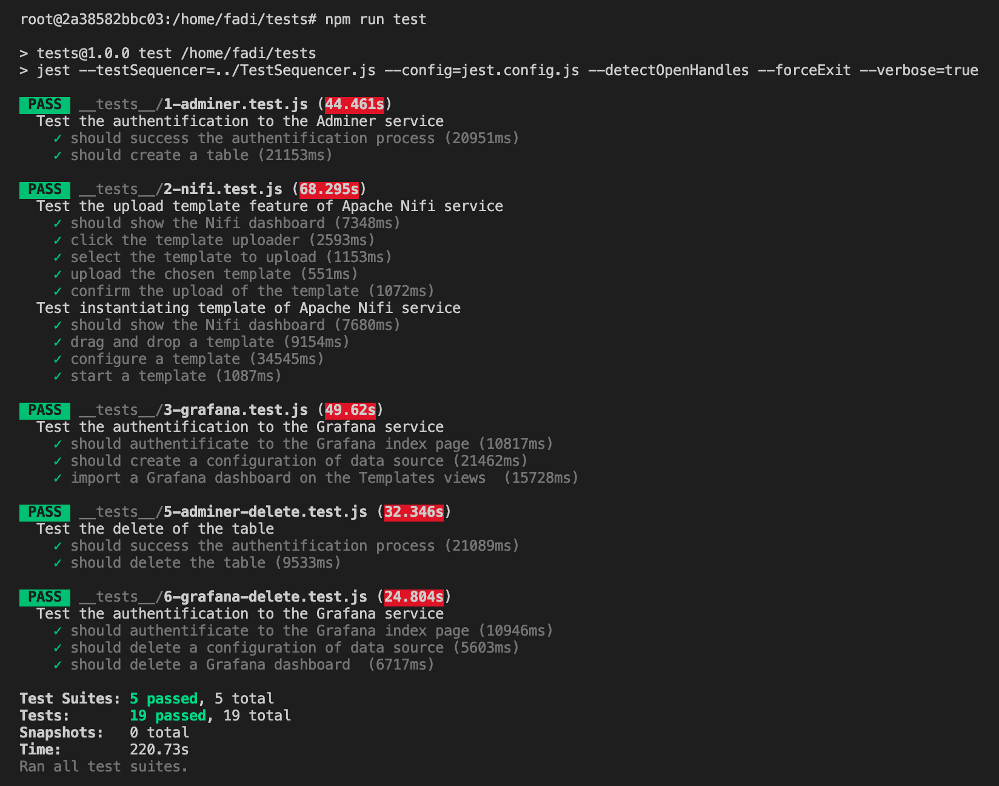

# Testing the FADI framework


[](https://pptr.dev) [](https://github.com/facebook/jest) 

* [Introduction](#introduction)
* [Quick start](#quick-start)
* [Example](#examples)
* [Documentation](#documentation)
* [References](#references)

## Introduction

The FADI framework is tested using Puppeteer and Jest.

[Puppeteer](https://pptr.dev) is a Node library which provides a high-level API to control Chrome or Chromium over the DevTools Protocol. Puppeteer runs headless by default, but can be configured to run full (non-headless) Chrome or Chromium.

[Jest](https://jestjs.io) is a JavaScript Testing Framework with a focus on simplicity. It works with projects using: Babel, TypeScript, Node, React, Angular, Vue and more!

## Quick start

To test the FADI framework, you need to implement the following instructions:

1. Install FADI framework. Refer to [the INSTALL section](../INSTALL.md).
2. Create a Docker container using [the Puppeteer-Jest Docker image](https://hub.docker.com/repository/docker/fzalila/docker-puppeteer-jest). To achieve that, run the following command:
  
```bash
docker container run --name testing-fadi  fzalila/docker-puppeteer-jest:latest
```

3. Inside the created container, clone the FADI repository:

```bash
git clone https://github.com/cetic/fadi.git
```

4. Configure [here](./lib/config.js) the urls and paths of different FADI platform services

5. Go to the `tests` folder and launch the tests:

```bash
cd fadi/tests
npm run test
```     

If tests pass, you should obtain the following results:



## Examples

The following example checks the creation of a `example_basic` table in the `postgres` database.  

```js 
it('should create a table', async () => {
    // Go to the indicated page 
    await page.goto(url)

    // Click on SQL query button 
    await click(page, '.ltr > #menu > .links > a:nth-child(1)')

    // type the query
    await typeText(page, 'CREATE TABLE example_basic (measure_ts TIMESTAMP NOT NULL,temperature FLOAT (50));', '.ltr > #content > #form > p > .jush')

    // Execute the table creation query
    await click(page, '.ltr > #content > #form > p > input:nth-child(1)')

    // Check the creation of the table
    await shouldExist(page, '#content > p.message')
})
```

More examples are available in the [test-scripts folder](doc/test-scripts/).

## Documentation

Test cases of the FADI framework are specified using Cockburns[[1](#references)] templates, available [here](doc/Cockburns-specification.md).

Test scripts specifications are available [here](doc/Test-scripts-specifications.md).

Two templates are available in order to define a new [test case](doc/cockburns/TC-template.md) and a new [test script](doc/test-scripts/TS-template.md).

## Continuous integration

To automate testing inside a continuous integration process, you can for example add a `test` stage to a Gitlab-CI pipeline by editing the [`.gitlab-ci.yml`](../.gitlab-ci.sample.yml) configuration:

```yaml
stages:
- deployWithHelm
- test

deployWithHelm:
[...]

test:
  stage: test
  image: ceticasbl/puppeteer-jest
  script:
   - cd tests/
   - npm run test
```

## References

[1] Alistair Cockburn. 2000. Writing Effective Use Cases (1st. ed.). Addison-Wesley Longman Publishing Co., Inc., USA.